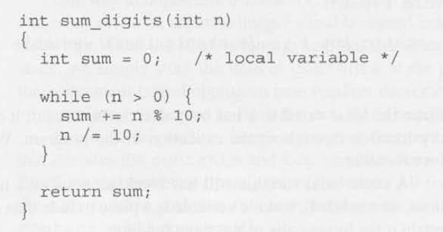
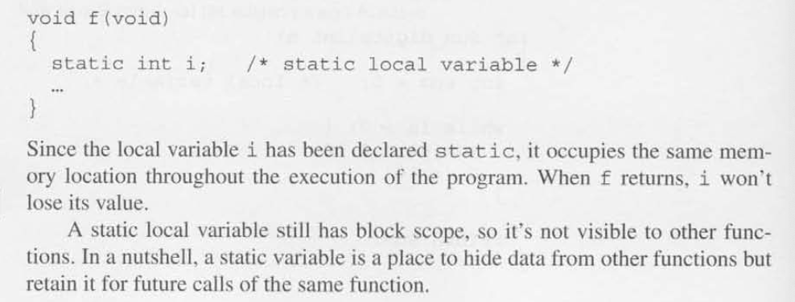
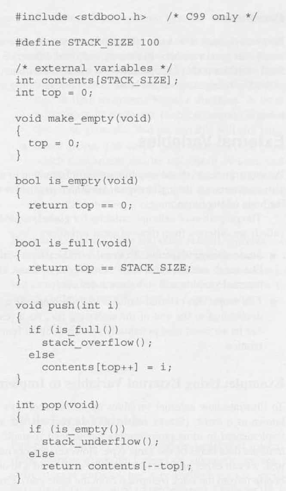
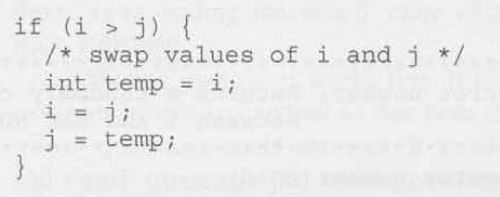
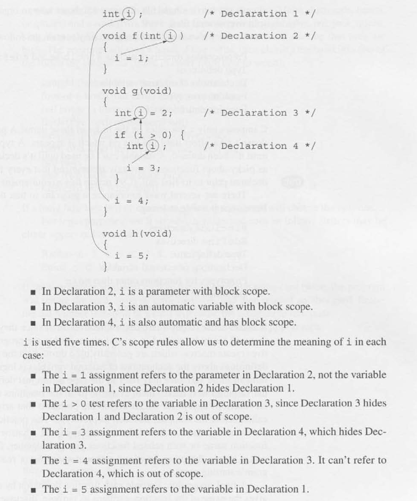

# Chapter 10 - Program Organization

## 10.1 - Local Variables

- Local Variable: A variable that is declared in the body of a function.

- Automatic Storage Duration: The storage duration of a variable is the portion of program execution during which storage for the variable exists. Storage for a local variable is "automatically" allocated when the enclosing functino is called and deallocated when the function returns, so the variable is said to have **automatic storage duration**. 
    - Local variables do not retain their value when its enclosing function returns.
    - Parameters have the same properties as local variables.
        - Initialized automatically when a function is called.

- Block Scope: The scope of a variable is the portion of the program text in which the variable can be referenced. A local variable has **block scope**: it is visible from its point of declaration to the end of the enclosing function body. 
    - Since the scope of a local variable doesn't extend beyond the function to which it belongs, other functions can use the same name for other purposes.

- Static Local Variables: Putting the word **static** in the declaration of a local variable causes it to have **static storage duration** instead of automatic storage duration. 
    - **Static Storage Duration**: Has a permanent storage location, so it retains its value throughout the execution of the program. 

## 10.2 - External Variables

- External Variable: Variables that are declared outside the body of any function.
    - Sometimes called "global" variables.
    - **Static Storage Duration**: External variables have SSD just like local variables that have been declared `static`. A value stored in an external variable will stay there indefinitely. 
    - **File Scope**: An external variable has file scope: it is visible from its point of declaration to the end of the enclosing file.

- External Variables -> Stack: A stack is a data structure where values can be accessed via the "top" or "end" of the stack: "pushed" onto the top and "popped" from the top only. 

## 10.3 - Blocks

- Blocks: Compound statements that can contain declarations of variables.
    - Variables declared and initialized in the block of functions or condition logic etc. are local to that block.
        - These variables have **Automatic Storage Duration**.
        - Variables that belong to a block can be declared `static` to give it static storage duration. 

## 10.4 - Scope

- Scope: The ability for the programmer and compiler to determine which identifier meaning is relevant at a given point in a program. 
    - When a declaration inside a block names an identifier that's already visible (because it has file scope or because it's declared in an enclosing block), the new declaration temporarily "hides" the old one, and the identifier takes on a new meaning. At the end of the block, the identifier regains its old meaning. 

## 10.5 - Organizing a C Program

- Possible way to organize your program:
    1. `#inculde` directives
    2. `#define` directives
    3. Type definitions
    4. Declarations of external variables
    5. Prototypes for functions other than `main`
    6. Definition of `main`
    7. Definitions of other functions