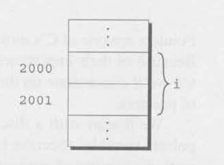
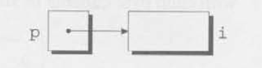
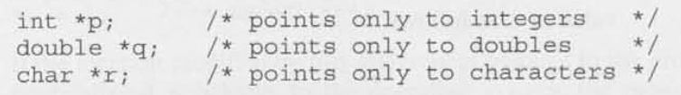
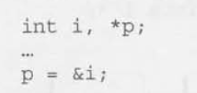
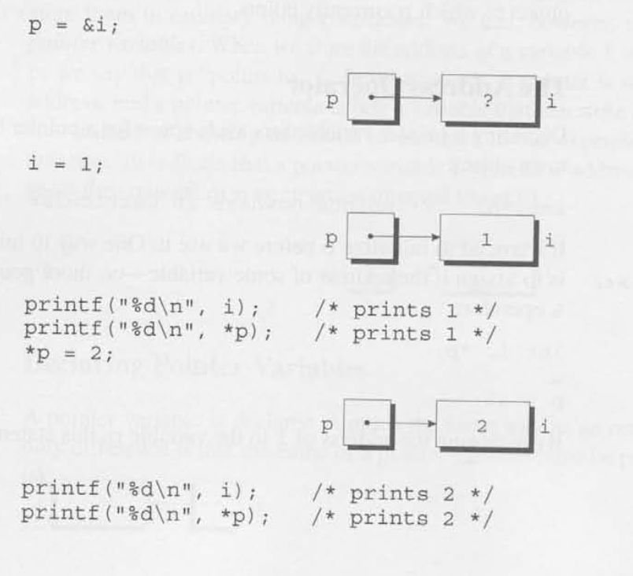
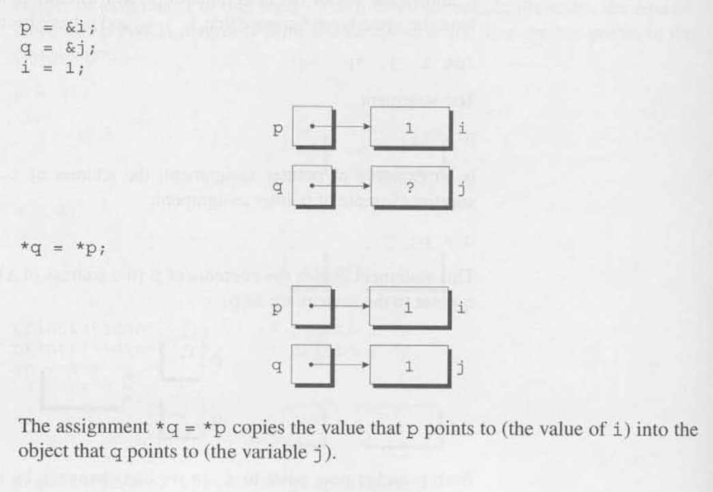

# Chapter 11 - Pointers

## 11.1 - Pointer Variables

- Byte: Main memory is divided into *bytes*, with each byte capable of storing eight bits of information.
    - Each byte has a unique memory address to distinguish it from other bytes in memory. 

- Address: Variables can occupy one or more bytes in memory depending on type. The *address* of a variable is the address of the first byte the variable occupies. 

- Pointer Variables: Specific variables used to house pointer memory addresses of other "variable" types.
    
    - Declaring: `int *p;` -> p is a pointer variable capable of pointing to objects of type int.
        - Can appear in declarations with other variables of same *referenced* type: `int i, j, a[10], b[20], *p, *q;`
            

## 11.2 - The Address and Indirection Operators

- Address Operator: To find the address of a variable, we use the & (address) operator. 
    - If `x` is a variable, then `&x` is the address of `x` in memory. 
    - Declaring: Sets aside space for a pointer but does not make it point to an object: `int *p;` -> points nowhere in particular.
        - Assign the pointer variable the address of some variable to initialize it for use. Can be used as an `lvalue` when combined with the `&` operator.
            

- Indirection Operator: To gain access to the object that a pointer points to, we use the `*` (indirection operator). 
    - If `p` is a pointer, the `*p` represents the object to which `p` currently points to.
    - As long as `p` points to `i`, `*p` is an alias for `i`. Not only does `*p` have the same value as `i`, but changing the value of `*p` also changes the value of `i`.
        - `*p` is an `lvalue`, so assignment to it is legal.
        

## 11.3 - Pointer Assignment

## 11.4 - Pointers as Arguments

## 11.5 - Pointers as Return Values
