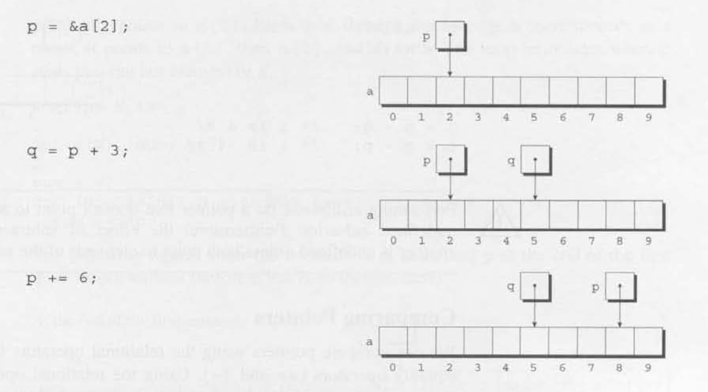
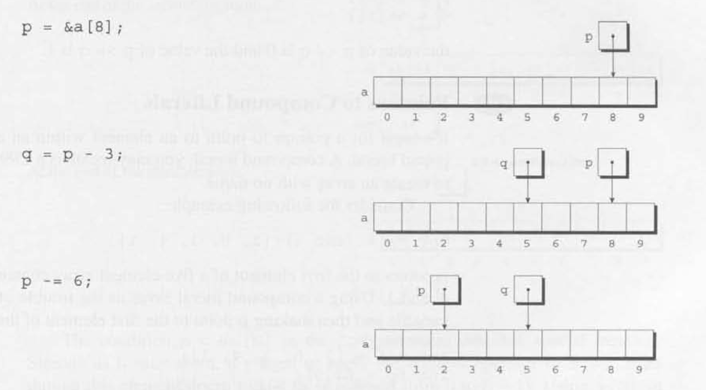
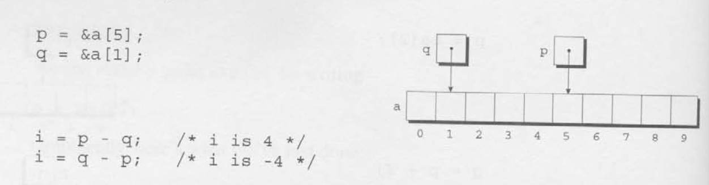
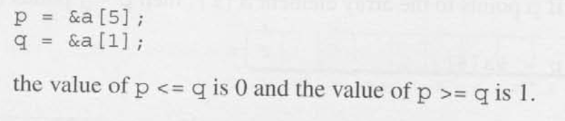
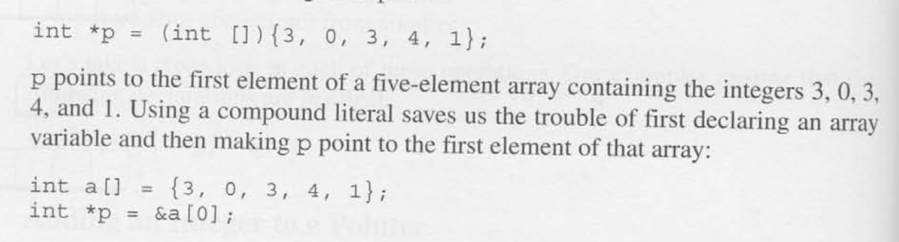
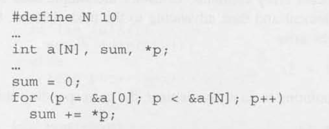
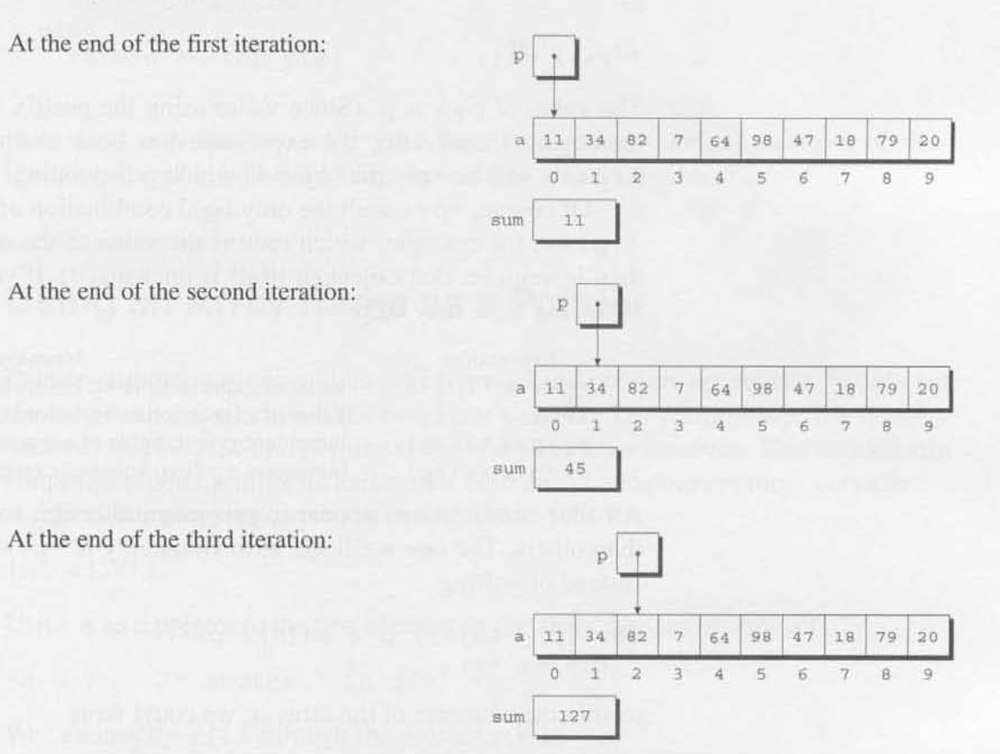
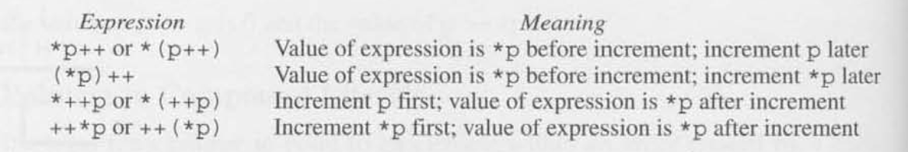
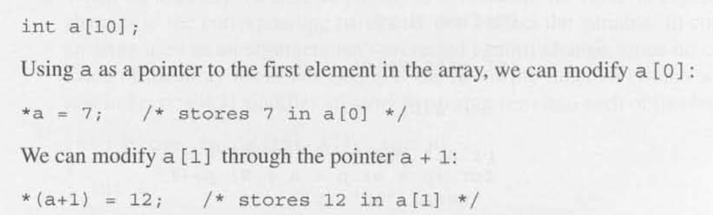

# Chapter 12 - Pointers and Arrays

## 12.1 - Pointer Arithmetic

- Pointer Arithmetic (address arithmetic): Can access the other elements of and array by:
    - Adding an integer to a pointer
    - Subtracting an integer from a pointer
    - Subtracting one pointer from another

- Adding an Integer to a Pointer: Adding an integer `j` to a pointer `p` yields a pointer to the element `j` places after the one that `p` current points to. 

- Subtracting an Integer from a Pointer: If `p` points to the array element `a[i]`, then `p - j` points to `a[i - j]`.

- Subtracting One Pointer from Another: When one pointer is subtracted from another, the result is the distance (measured in array elements) between the pointers.
    - If `p` points to `a[i]` and `q` points to `a[j]`, then `p - q` is equal to `i - j`.

- Comparing Pointers: We can compare pointers using the relational operators `<`, `<=`, `>`, `>=` and the equality operators (`==` and `!=`).
    - Using the relational operators to compare two pointers is meaninful only when both point to elements of the same array.

- Pointers to Compound Literals (C99): 

## 12.2 Using Pointers for Array Processing

- Combining the `*` and `++` Operators: When you combine the dereference operator `*` with increment/decrement (`++` / `--`) in C (or similar languages), the key is operator precedence and when the increment happens.

## 12.3 Using an Array Name as a Pointer

- The name of an array can be used as a pointer to the first elemetn in the array.

## 12.4 Pointers and Multidimensional Ararys 

# 12.5 Pointers and Variable-Length Arrays (C99)