# Chapter 13 - Strings

## 13.1 String Literals

- String Literal: Sequence of characters enclosed within double quotes.
    - Cannot be modified when created.
        - Cannot index and overwrite a character.

- Escape Sequences: String literals may contain the same escape sequences as character constants.

- Continuing a String Literal: 
    - Use `\` at the end of a line to carry-on a string literal.
    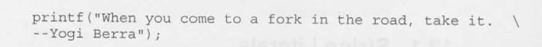
    - When two or more string literals are adjacent (separated only by white space), the compiler will join them into a single string.
    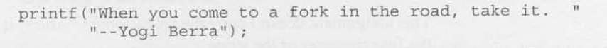

- Null Character: `'\0'` that is placed at the end of string literals in memory to signify the end of a string. 
    - Size: Byte whose bits are all 0.
    - Don't confuse the null character `'\0'` with the zero character `'0'`. The null character has the code 0; the zero character has a different code (48 in ASCII).

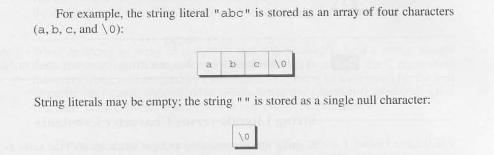

## 13.2 String Variables

- Strings as Arrays
    - Define string array lengths `n + 1` to leave room for the null character at the end.
        - Because the string characters are in an array we can index an modify the characters unlike a string literal.
    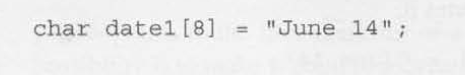
    - The compiler will put the characters from "June 14" in the datel array, then
    add a null character so that datel can be used as a string. 
    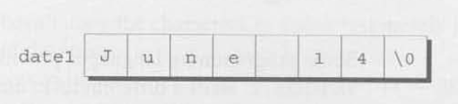
    - If the string initializer is too short for the amount of memory places in the array, the compiler will fill with null characters.
    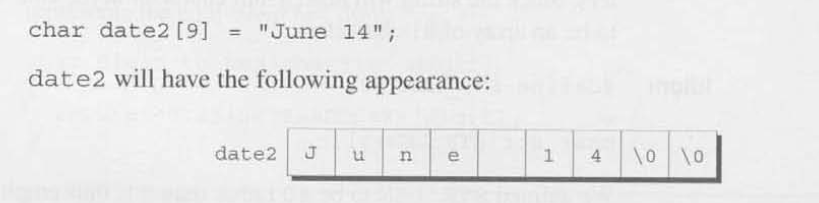
    - If the string initializer is too long for the amount of memory places in the array, the compiler will fill the array up to its limits, leaving off the remainder of the string, however long.
    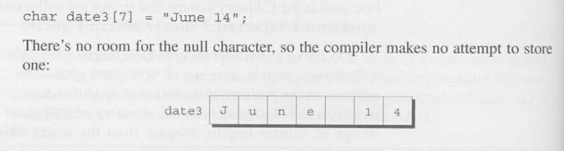
    - You can omit the length in the declaration and the compiler will compute the amount of memory needed automatically.
    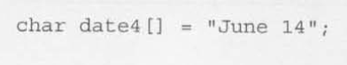

- Strings as Pointers
    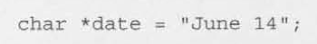
    - This is a string literal and we cannot modify the index compondents like array strings. 

## 13.3 Reading and Writing Strings

- Writing Strings using `printf` and `puts`
    - `printf`
        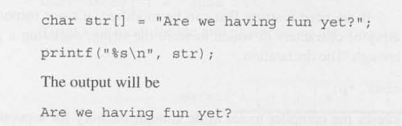
        - Print only a slice: `%.ps` where `p` is the number of characters to be displayed.
        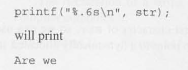
        - Print a string within a field with `%ms` where `m` is the field size. A string will more than `m` characters will be printed in full NOT truncated!
            - If the string has fewer characters than `m` the string will be right justified by default unless `-m` for left justify.
        - Use `m` and `.p` in unison -> `%m.ps` which causes the first `p` characters of a string to be displayed in a field of size `m`.
    - `puts`
        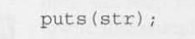
        - Only has one argument, the string to be printed. After writing the string `puts` always writes an additional new-line character. 

- Reading Strings using `scanf` and `gets``

    - `scanf`
        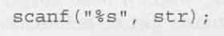
        - Skips whitespace then reads characters and stores them in `str` until it encounters a white-space character.
        - Always stores a null character at the end of the string.
        - A string reading using `scanf` will NEVER contain whitespace.
        - New-line character will cause scanf to stop reading, but so will a space or tab character. 
    - `gets`
        - Stores a null character at the end of a read string.
        - Does not skip white space before strating to read the string.
        - Reads until it finds a new-line character.
        - Discards the new-line character instead of storing it in the array, a null character takes its place

## 13.4 Accessing the Characters in a String

- Since strings are stored as arrays, we can use subscripting to access the characters in a string. 
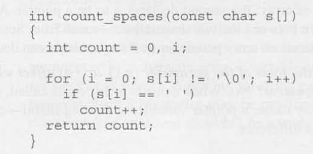
- More common to use a pointer to the string start:
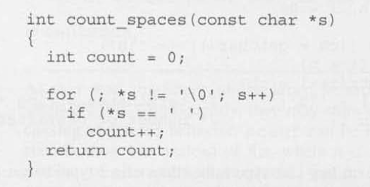

## 13.5 Using the C String Library
- Functions found in `<string.h>`
- String Copy `strcpy`:
    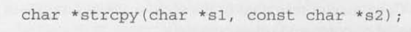
    - Copies the string `s2` into the string `s1`. (To be precise, we should say
    "copies the string pointed to by `s2` into the array pointed to by `s1`.")
    That is, copies characters from `s2` to `s1` up to (and including) the first null character in `s2`. 
    - Returns `s1` (a pointer to the destination string). The string pointed to by `s2` isn't modified, so it's declared `const`
    .

- String N Copy `strncpy`:
    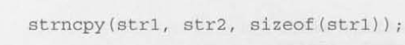
    - Calling the `strncpy` function is a safer, albeit slower, way to copy a string. 
    - Has a third argument that limits the number of characters that will be copied. 
        
- String Length `strlen`: 
    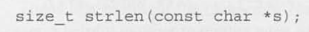
    - `size_t`: represents one of C's unsigned integer types. 
    - Returns the length of a strings: the number of characters in `s` up to, but not including, the first `null` character. 
    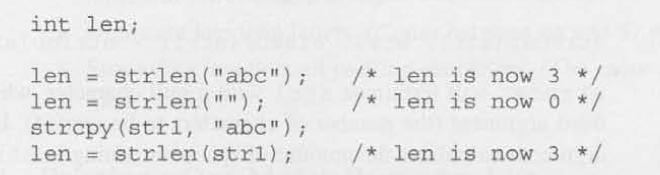

- String Concatenation `strcat`:
    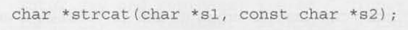
    - Appends the contents of the string `s2` to the end of the string `s1`; it
    returns `s1` (a pointer to the resulting string).
    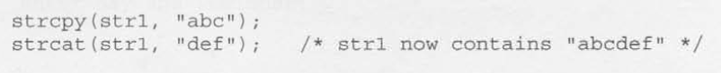

- String N Concatentation `strncat`:
    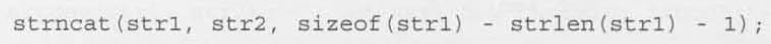
    - safer but slower version of `strcat`.
    - Has a third argument that limits the number of characters it will copy.

- String Comparison Function `strcmp`:
    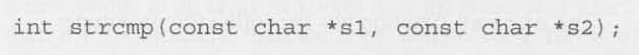
    - Compares the strings `s1` and `s2`, returning a value less than, equal to, or
    greater than 0, depending on whether `s1` is less than, equal to, or greater than `s2`.
    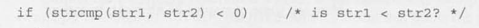
    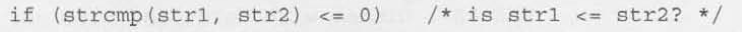
    - Compares strings based on their lexicographical ordering.
    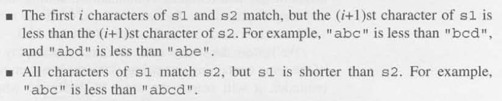
    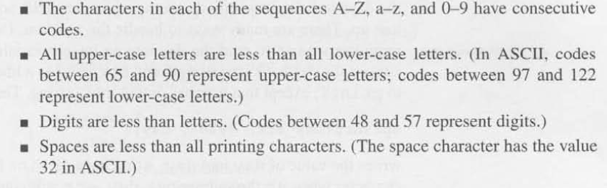

## 13.6 String Idioms

## 13.7 Array of Strings

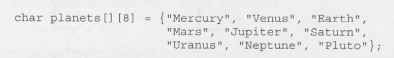
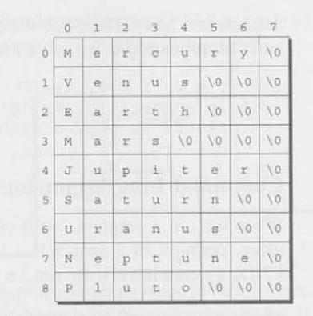
- All space in the array is used wether needed be the string or not, this a waste of memory.
- Declare an array of pointers to strings for explicit sizing:
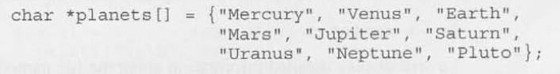
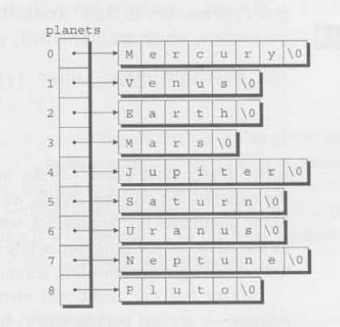

- Command Line Arguements

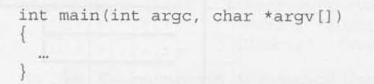
- `argc` ("argument count") is the number of command-line arguments (including
the name of the program itself. 
- `argv` ("argument vector") is an array of pointers to the command-line arguments, which are stored in string form. 
    - `argv[0]` points to the name of the program, while `argv[1]` through `argv [argc-1]` point to the remaining command-line arguments.
    - `argv` has one additional element, `argv[argc]`, which is always a null pointer—a special pointer that points to nothing (NULL macro).

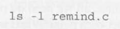
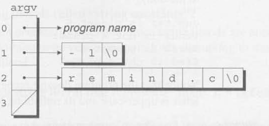