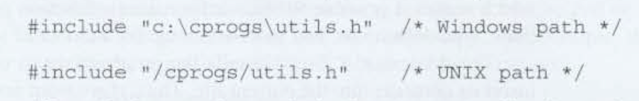
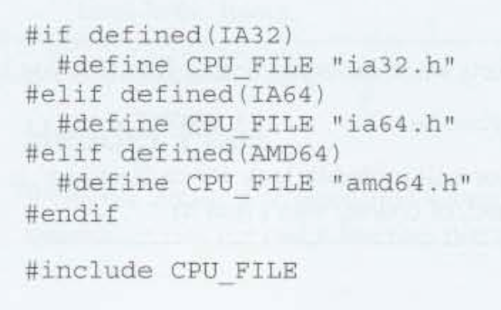
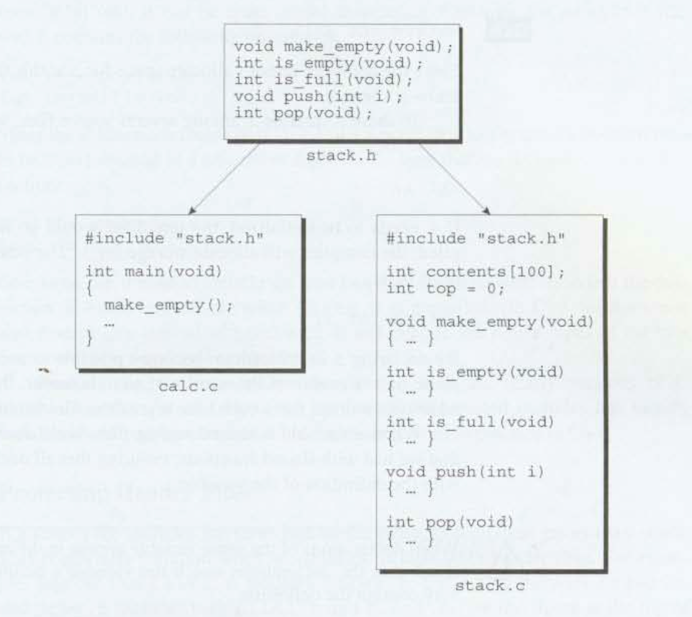
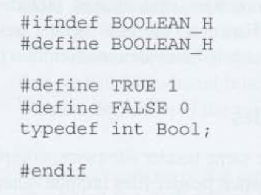
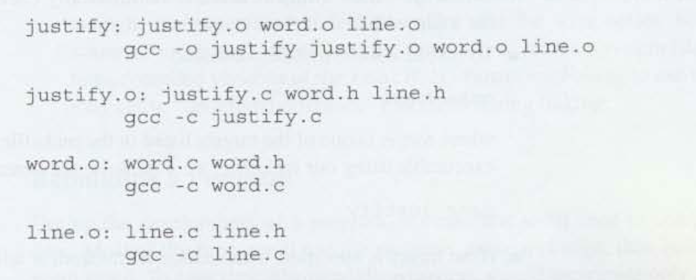
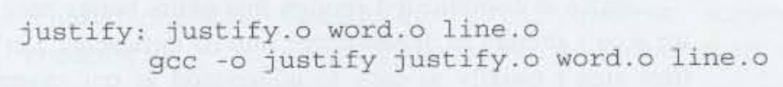

# Chapter 15 - Writing Large Programs 

## 15.1 Source Files

- Source Files: Files that have the `.c` extension.
    - Each source file contains part of the program, primarily definitions of functions and variables.

- Benfits of splitting into multiple files:
    - Individual compilation of files for frequent changes of separate scopes.

## 15.2 Header Files

- Header File: Files that are included via the `#include` directive.
    - End in `.h` extension.
    - Sometimes refered to as *include files*.

- `#include` Directive: 
    - 3 Forms:
        1. `#inlcude <filename>`: Used for header files that belong to C's own library.
        2. `#include "filename"`: Used for all other header files.
        3. `#include tokens`: Replace and macros that with the tokens.
    - `-Ipath`: a command-line option used to edit the default search path for header files.

- Note: This is not a string literal and backslashes are not escaped!

- `extern` variables: Variables declared with `extern` are linked to variable definitions found in header files when included. Memory is set aside once for the variable and shared amongst the files where included in.
    - Omit the size of an array when using `extern` variable for an array.
    

- Protecting Header Files:

## 15.3 Dividing a Program into Files

## 15.4 - Building a Multiple File Program

- Makefiles: a file containing the information necessary to build a program.
    - A makefile not only lists the files that are part of the program, but also describes dependencies among the files. 
    1. Each command in a makefile must be preceded by a tab char.
    2. A makefile is normall stored in a file named `Makefile` or `makefile`.
    3. To invoke --> `make target`

- Rule: groups of lines in a makefile.
- Targets: The first line in a rule (the target file to build) followed by the target's file dependencies.
- Command: Tabbed nested line in a rule. 

- Defining Macros Outside a Program
- `gcc -D`: Define a macro in-line. 
    - 
- `gcc -U`: Undefine a macro in-line.
