# Chapter 16 - Structures, Unions, and Enumerations

## 16.1 Structure Variables

- Structure Variables: A collection of elements or data types that do not have to be the same overall type and are grouped into a "container".
    - Members: Data objects found within structures.
    - Access members of a strucure with `.` operator.
    - Names declared in the scope of a structure are scoped to that structure.
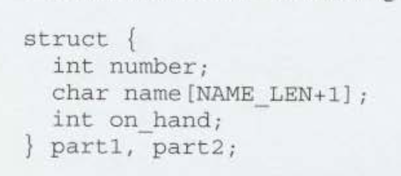
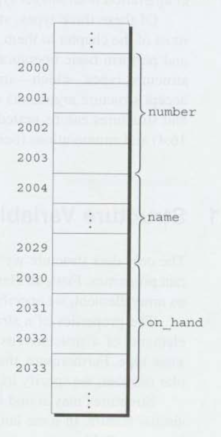
- `int` 4 byte
- `NAME_LEN` 25 chars

- C99 Designated Initializer
    - Order does not matter
    - Undesignated values default to initalizer order.
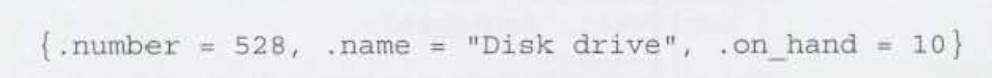

- Structures variables of the same type can be copied directly with `=`.
    - Even arrays within the structure are copied unlike arrays alone.

## 16.2 Structure Types

- Structure declartions without a *type* name cannot be reused elsewhere to create the same *type* of structure.
    - We need to provide a *type* name to the structure.

1. Structure Tag: a name used to identify a particular kind of strueture.

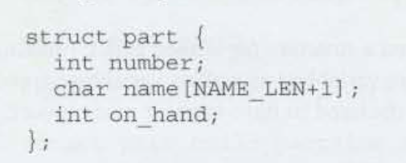

- `part` name defines the reusable `struct part` type.
    - Semicolon follows to close the definition.
- Use `struct part` to define new variables.
    - Cannot abbreviate the declaration.

2. Define a Structure Type: we can use typedef to define a genuine type name.

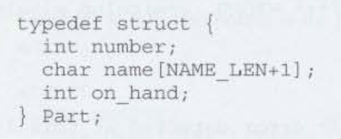

- `Part` is the name of the type and comes at the end. 
    - Now `Part` can be used the same way other types like `int` etc. are to declare variables.

- C99 Compound Literals: Creating structures on the fly.

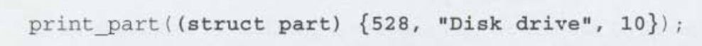

## 16.3 Nested Arrays and Structures

- Nested Structures: Putting a stucture within another structure.

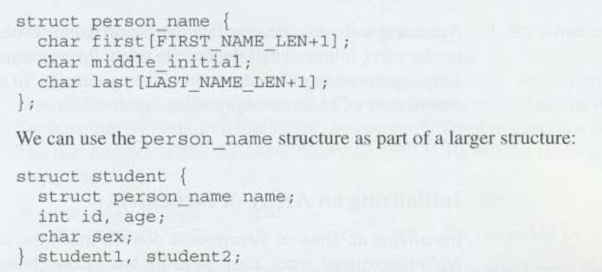

- Arrays of Structures: An array whose elements are structures.

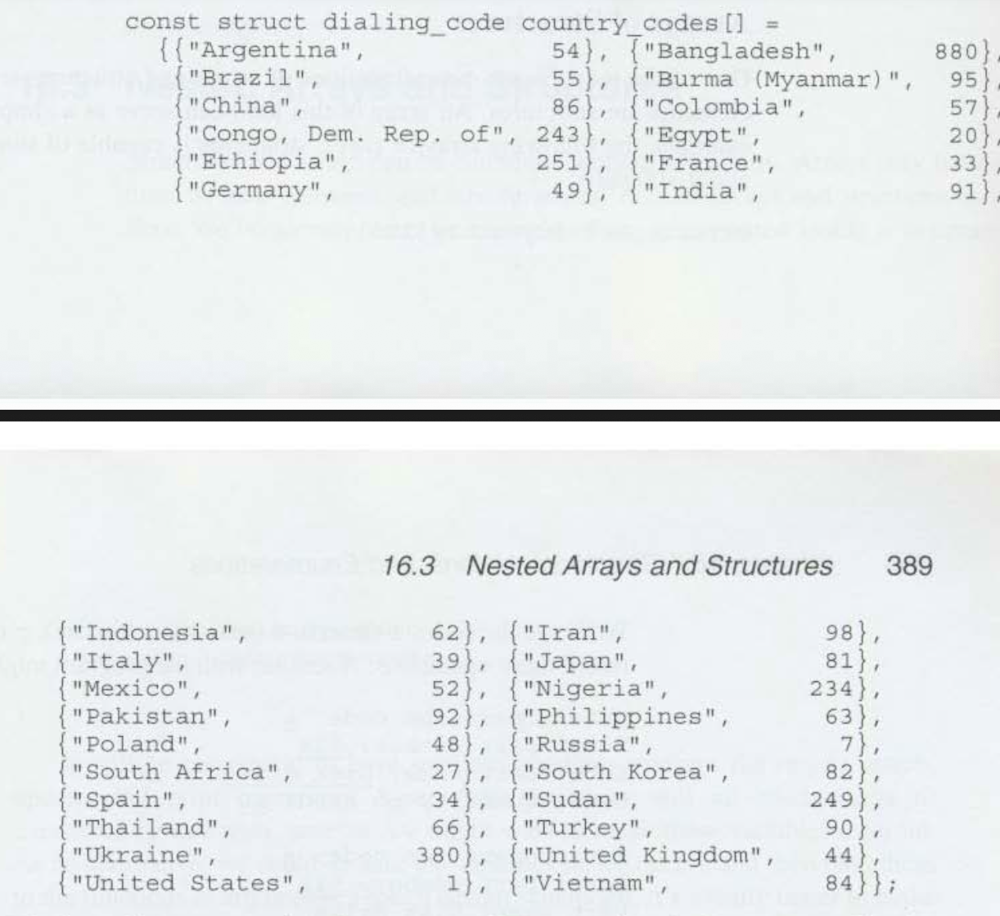

## 16.4 Unions

- Unions: Like a structure, consists of one or more members, possibly of different types. However, the compiler allocates only enough space for the largest of the members, which overlay each other within this space. As a result, assigning a new value to one member alters the values of the other members as well.

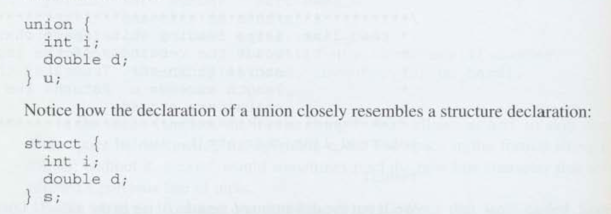
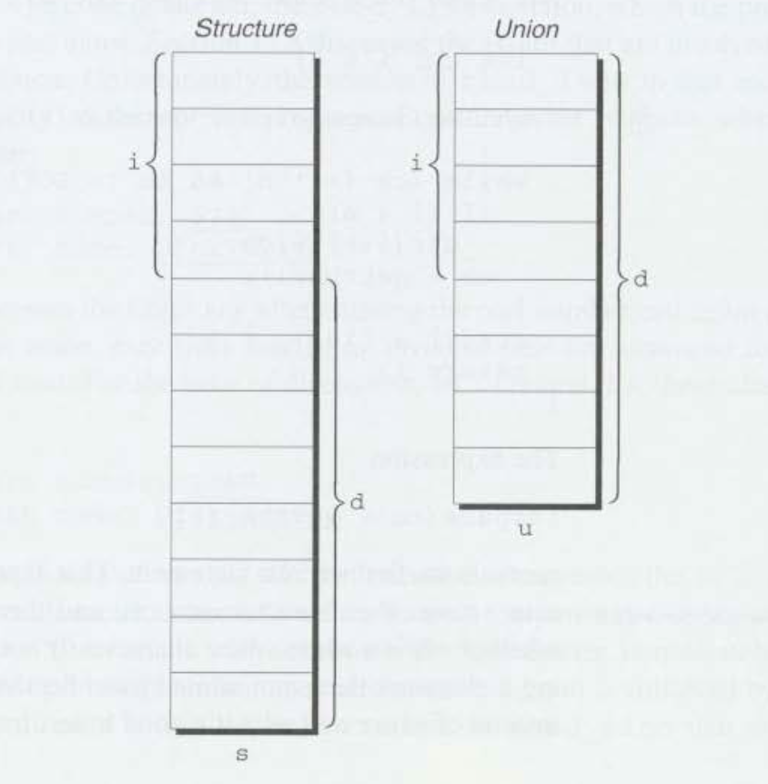

- Follow the same type tag and define property of structures.

## 16.5 Enumerations

- Enumerations: variables that have a small number of possible values.

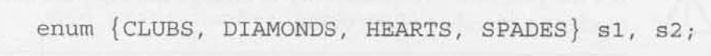

- Follow the same type tag and define property of structures.

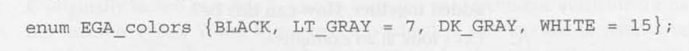

- When no value is given for an enumeration constant it defaults to the value one greater thatn the previous constant.
    - The first constant is 0 given a 0 if not specified.