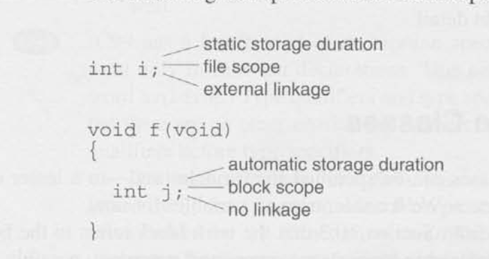
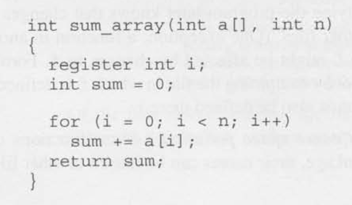

# Chapter 18 - Declarations 

## 18.1 - Declaration Syntax

- Declaration Specifiers: describe the properties of the variables or functions being declared. 
    1. Storage classes: At most one storage class may appear in a declaration; if present, it should come first.
        - auto
        - static
        - extern
        - register
    2. Type qualifiers: In C89, there are only two type qualifiers, a declaration may contain zero or more type qualifiers: 
        - const (C89)
        - volatile (C89)
        - restrict (C99)
    3. Type specifiers: The keywords void, char, short, int, long, float, double, signed, and unsigned are all type specifiers. 

- Declarators: Give their names and may provide additional information about their properties.

## 18.2 - Storage Classes

- Storage duration: The storage duration of a variable determines when memory is set aside for the variable and when that memory is released.
    - Automatic: allocated when the surrounding block is executed; storage is deallocated when the block terminates, causing the variable to lose its value.
    - Static: stays at the same storage location as long as the program is running, allowing it to retain its value indefinitely.

- Scope: the portion of the program text in which the variable can be referenced.
    - Block: the variable is visible from its point of declaration to the end of the enclosing block.
    - File: the variable is visible from its point of declaration to the end of the enclosing file.

- Linkage: determines the extent to which a variable can be shared by different parts of a program.
    - External: may be shared by several (perhaps all) files in a program.
    - Internal: restricted to a single file, but may be shared by the functions in that file.

- Register Storage Class: declaration of a variable asks the compiler to store the variable in a register instead of keeping it in main memory like other variables. (A register is a storage area located in a computer's CPU. Data stored in a register can be accessed and updated faster than data stored in ordinary memory.)
    - Only declared in a **block**.
    - Has the same storage duration, linkage, and scope as an automatic variable.
    - Has no address `&`. 

## 18.3 Type Qualifiers

- Const: used to declare objects that resemble variables but are "read-only".
    - a program may access the value of a const object, but can't change it.

- Volatile: coming soon...

## 18.4 - Declarators

## 18.5 Initializers

## 18.6 Inline Functions (C99)

