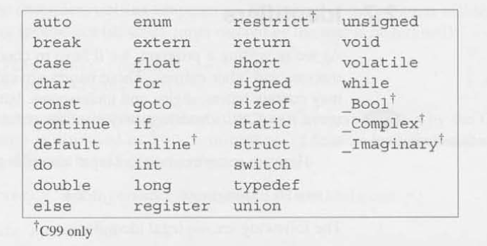
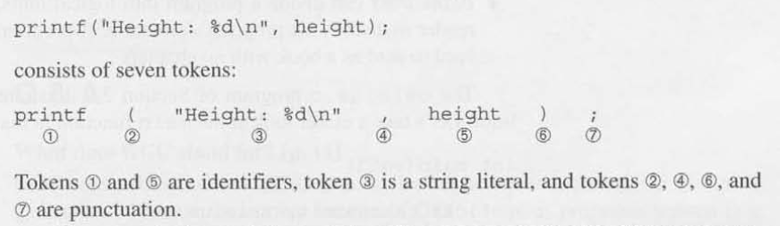

# Chapter 2 - Fundamentals

## 2.1 Writing a Simple Program

```c
#include <stdio.h>

int main(void)
{
    printf("To C, or not C: that is the question.\n");
    return 0;
}
```

- `#include <stdio.h>`: Indicates inclusion of the `standard I/O` library, a package/collection of helpful tools/functions.

- `printf`: A function that prints formatted text to the terminal window, found within the `standard I/O` library.
    - `\n`: An *escape character* to indicate the cursor to move to a new line within the `printf` call.

- `return 0;`: Indicates that the program "returns" the value 0 to the operating system when it terminates.

- Steps to convert *program.c* to a form that the machine can execute:
    1. **Preprocessing**: The program is first given to a **preprocessor**, which obeys commands that begin with **#** (known as **directives**). A preprocessor is a bit like an editor; it can add things to the program and make modifications.
        - Typically integerated with the **compiler**.
    2. **Compiling**: The modified program now goes to a compiler, which translates it into machine instructions (**object code**). The program isn't quite ready to run yet, however.
    3. **Linking**: In the final step, a **linker** combines the object code produced by the compiler with any additional code needed to yield a complete executable program. This additional code includes library functions (like `printf`) that are used in the program.

- `cc` Compiler: The compiler used under **UNIX**.
    - `cc your_file.c`
    - After compiling and linking the program, `cc` leaves the executable program in a file named `a.out` by default. 
    - `-o`option: Allows us to choose the name of the file containing the executable program. 
        - `cc -o your_file your_file.c`

- `gcc` Compiler: The compiler supplied with **Linux** but is available for many other platforms as well. Has similar use/handling as `cc` compiler.
    - `gcc -o your_file your_file.c``

## 2.2 The General Form of a Simple Program

- Directives: Commands intended for the preprocessor prior to compilation.
    - Always begin with a `#` character.
    - One line long, no semicolon.

- Headers: `.h` files that contain additional functions/code to be "included" into the program before it is compiled.
    - Ex. `<stdio.h>` -> standard I/O library

- Functions:  simply a series of statements that have been grouped together and given a name. Some functions compute a value; some don't. A function that computes a value uses the `return` statement to specify what value it "returns."
    
- `main`: The only mandatory function within a C program, that gets called automatically when the program is executed.
    - Returns a *status code* (0 or 1) back to the operting system when the program terminates.
    - See [2.1 Writing a Simple Program](#21-writing-a-simple-program) for example.

- Statements: A command to be executed when the program runs.
    - Ex. `return`, `my_func()`

- Printing Strings:
    - String Literal: A series of characters enclosed in double quotation marks.
    - `\n`: New-line character, terminating output on the current line, and moving subsequent output to the next line.

## 2.3 Comments

- 2 Types of Comments:
    1. `/* This is a comment */`
        - Requires opening (`/*`) and closing (`*/`) symbols to encase the comment text within.
        - Can wrap on multiple lines.
    2. `// This is a comment`
        - Requires only the opening (`//`) symbol and restricts the rest of the line to a comment.

## 2.4 Variables and Assignment

- Variables: A way to store data temporarily during program execution.

- Types: A description of what kind of data a variable holds.
    - Numeric Types: Determine the lrages and smallest numbers that the variable can store, as well as whether or not digits are allowed after the decimal point.
        - `int`: Short for *integer*, can store a signed or unsigned (positive or negative) whole integer like 0, 1, 392, or -2553.
        - `float`: Short for *floating-point*, can store much larger numbers than an `int` variable, as well as number **after** the decimal point.
            - Arithmetic on `float` can be slower than that on type `int`.
            - The value of a `float` is often just an approximation of the number that was stored in it. 
                - Ex. float num = 0.1f; -> 0.099999999987 due to *rounding error*.

- Declarations: Variables must be **declared** before they can be used.
    - Ex. `int length, height, width;`

- Assignment: A variable can be given a value by means of assignment.
    - When assigning a `float` value, append an `f` to the end of the number to explicitly indicate the type to the compiler.
    - Ex. `float dec = 3.14f;`

- Print Variable Values: We can use `printf` to display the current value of a variable.
    - Placeholder characters for different variable types:
        1. `%d`: Integer -> `int` ("digit")
        2. `%f`: Float -> `float`
            - To display the `p` number of digits after the decimal use `.p` inbewteen `%` and `f` -> `%.pf`

- Initialization: When a variable is assigned a value it is then **initialized**, variable without assignment or considered **uninitialized**.
    - Accessing an uninitialized variable via a `printf` reference could lead to and is called "undefined behavior".
    - Initializer: The value or expression used to assign an initial value to a variable at the time it is declared.
        - Ex. `int num = 5;` -> `5` is the **initializer**

- Printing Expressions: `printf` isn't limited to displaying numbers stored in variables; it can display the value of any numeric expression.
    - Ex. `printf("%d\n", height * length * width);`

## 2.5 Reading Input

- `scanf`: Function to get input from the user via the console and store it in a variable.
    - Needs to know what form the input data will take (`int`, `float`, etc.)
    - Ex. `scanf ("%d", &i ) ; /* reads an integer; stores into i */`
        - The `"%d"` string/format-specifier tells `scanf` to read input that represents an integer; `i` is an `int` variable into which we want `scanf` to store the input. `&`(not mention in the chapter) provides the memory address for this new `int i` variable to save the value at said memory location.


## 2.6 Defining Names for Constants

- Macro Definition: A **preprocessor directive** that defines a name or identifier to represent a value or piece of code. When the program is compiled, the preprocessor replaces every occurrence of the macro name with its defined value or code before actual compilation begins.
    - Ex. `#define PI 3.14159 `,

## 2.7 Identifiers

- Identifiers: Chosen names for variables, functions, macros, and other entities.
    - May contain letters, digits, and underscores, but must begin with a letter or underscore.
    - **Case-sensitive!**
    - Ex. `times10`, `get_next_char`, `_done`

- Keywords: Reserved words in C that have predefined meanings and serve specific purposes in the language’s syntax. They cannot be used as identifiers (such as variable or function names).
    - **Case-senstive!**




## 2.8 Layout of a C Program

- Tokens: Groups of characters that can't be split up without changing their meaning.
    - Identifiers, keywords, operators, and punctuation are all tokens.



