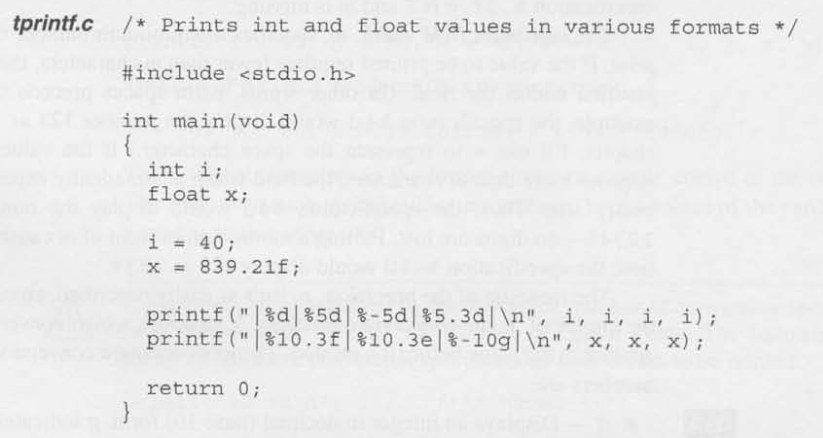
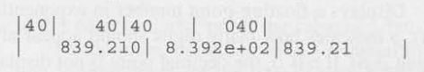
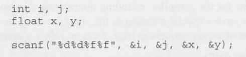
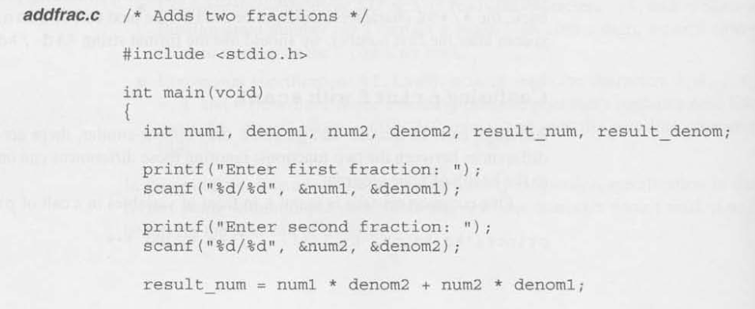
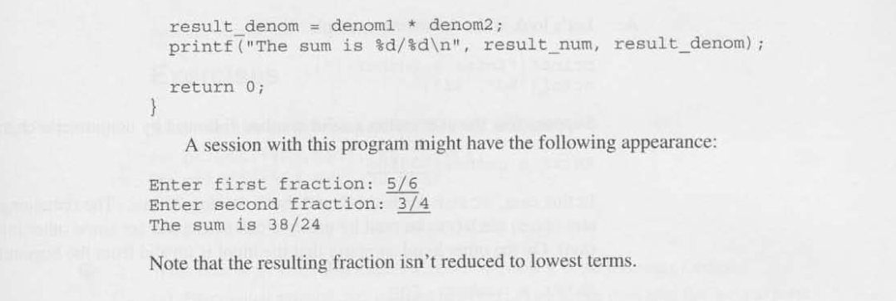

# Chapter 3 - Formatted Input/Output

## 3.1 The `printf` Function

- `printf`: A function designed to display the contents of a string, known as the **format string**, with values possibly inserted at specified points in the string.
    - Ex. `printf(string, expr1, expr2, ...);`

- Conversion Specifications: A placeholder representing a value to be filled in during printing. Begins with `%` and is followed by a character (`f`, `d`, etc.) that specifies how the value is *converted* from its internal form (binary) to printed form (characters).
    - Common Conversion Specifiers:
        1. `d`: Displays an integer in decimal (base 10) form. `p` indicates the minimum nymber of digits to be displayed (extra zeros are added to the beginning of the number if neccessary).
        2. `e`: Displays a floating-point number in exponential format (scientific notation). `p` indicated how many digits should appear after the decimal point (the default is 6). If `p` is 0, the decimal point is not displayed.
        3. `f`: Displays a floating-point number if "fixed decimal" format, without an exponent. `p` has the same meaning as for `e`.
        4. `g`: Displays a floating-point number is either exponential format or fixed decimal format, depending on the number's size. `p` indicates the maximum nymber of significant digits (not after the decimal point) to be displayed. Unlike the `f` conversion, the `g` conversion won't show trailing zeros. 
    - Optional Formatting: `%m.pX` or `%-m.pX`
        - `m`-> Minimum Field Width (the minimum number of characters to be "reserved" for that value insertion)
            - Positive `m` indicates "right justified" characters.
            - Negative `m` indicated "left justified" characters.
        - `.p` -> Precision of inserted value (rounding or added values for required length of actual value).
    - Ex. `printf("Whole Number: %d/n", i);`
        - `i` is an integer and is inserted at %d (conserion specifier) within the string.

- NOTE: C compilers aren't required to check that the number of conversion specifications in a format string matches the number of output items.

- Escape Sequences: Escape sequences enable strings to contain characters that would otherwise cause problems for the compiler, including nonprinting (control) characters and characters that have a special meaning to the compiler (such as ").
    - Common Escape Sequences:
        1. `\a`: Alert (audible beep)
        2. `\b`: Backspace (cursor moves back one position)
        3. `\n`: New line (move cursor to beginning of next line)
        4. `\t`: Horizontal tab (move cursor to next tab stop)
    - To print literal `"` or `\` escape them using `\` like normal.
        - Ex. `\"`, `\\`

## 3.2 The `scanf` Function

- `scanf`: Reads input according to a particular format.
    - For each conversion specification in the format string, scanf tries to locate an item of the appropriate type in the input data, skipping blank space if necessary.
    - Returns an **integer** representing the number of successful reads and 0 or -1 for failure.
    - Ignores **white-space characters** (the space, horizontal and vertical tab, form-feed, and new-line characters).

- Rules `scanf` Follows:
    - Integer: It first searches for a digit, a plus sign, or a minus sign; it then reads digits until it reaches a nondigit. 
    - Float: Looks for a plus or minus sign (optional), followed by a series of digits (possibly containing a decimal point), followed by an exponent (optional). 
        - An exponent consists of the letter `e` (or `E`), an optional sign, and one or more digits.

