# Chapter 4 - Expressions

- Expressions: Formulas that show how to compute a value.
    - Variables: Represents a value to be computed as the program runs.
    - Constants: Represents a value that doesn't change.

- Operators: Symbols that perform specific operations on values or variables (e.g., +, -, *, /).
- Operands: The values or expressions on which the operators act.

## 4.1 Arithmetic Operators

- Arithmetic Operators: Operators that perform addition, subtraction, multiplication, and division.

- Unary: Operators that only require **one** operand.
    
- Binary: Operators the require **two** operands.
    - Additive:
        - Addition `+`: Adds two values together. 
        - Subtraction `-`: Subtracts two values from another. 
    - Multiplicative:
        - Multiplication `*`: Multiplies two values together.
        - Division `/`:
            - `int / int` "integer division" returns the *floored* value of the quotient.
            - `float / int`: returns a `float`.
        - Remainder (modulo) `%`: `i % j` returns the remainder of the quotient `i / j`.
            - Requires both operands to be type `int`.

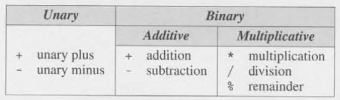

- Implementation-defined Behavior: The C standard allows certain aspects of the language to vary between different compilers, architectures, or operating systems, but requires that the implementation document how it behaves.

- Operator Precedence and Associativity: Rules that determine the order in which operators in an expression are evaluated.
    - Precedence: Defines which operators are evaluated first.
        - Ex. 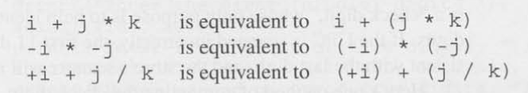
    - Associativity: Defines the order of evaluation when operators of the same precedence appear together (for example, left-to-right or right-to-left).
        - Left Associative: Operators that group from left-to-right.
            - Binary Arithmetic Operators (`*`, `/`, `%`, `+`, and `-`).
            - Ex. 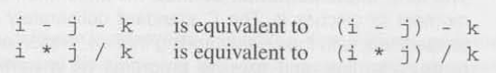

        - Right Associative: Operators that group from right-to-left.
            - Unary Arithmetic Operators (`+` and `-`).
            - Ex. 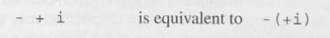


## 4.2 Assignment Operators

- Simple Assignment (`=`): The effect of the assignment `v = e` is to evaluate the expression `e` and copy its value into `v`.
    - Ex. 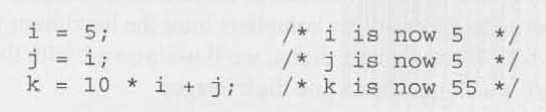
    - If `v` and `e` do not have the same type, then the value of `e` is converted to the type of `v`.
        - Ex. 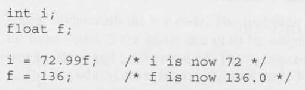

- Side Effects: When an operator modifies their operand.
    - Simple Assignment (`=`) has side effects, it modifies its left operand.
        - Ex. Evaluating the expression `i = 0` produces the result `0` and, as a side effect, assigns `0` to `i`.

- Lvalues: Represents an object stored in computer memory, not a constant or the result of a computation.
    - Variables are Lvalues; expressions such as `10` or `2 * i` are not.
    - Ex. 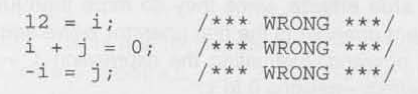

- Compound Assignment: A shorthand operator that performs an arithmetic (or bitwise) operation and assignment in one step, updating the variable in place.
    - Ex. 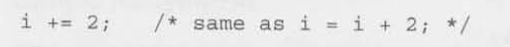
    - Ex. 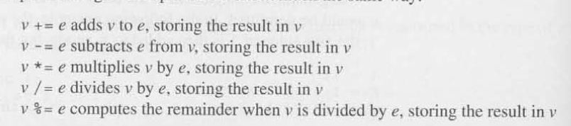

## 4.3 Increment and Decrement Operators

- Incrementing: Adding a value of 1.
- Decrementing: Subtracting a value of 1.

- Ways to Increment/Decrement:
    1. Basic Arithmetic
    ```c
        var = var + 1; // increment
        var = var - 1; // decrement
    ```
    2.  Compound Assignment
    ```c
        var += 1; // increment
        var -= 1; // decrement
    ```
    3.  Increment/Decrement Operators
    ```c
        ++var;   // prefix increment
        var++;   // postfix increment
        --var;   // prefix decrement
        var--;   // postfix decrement
    ``` 
    - Prefix and Postfix Operators (`++` and `--`)
        - Prefix: The variable is modified before its value is used in an expression.
            - Ex.
            ```c
                int x = 5;
                int y = ++x;   // x becomes 6, y = 6
            ```
        - Postfix: The variable is modified after its current value is used in an expression.
            - Ex.
            ```c
                int x = 5;
                int y = x++;   // y = 5, then x becomes 6   
            ```

## 4.4 Expression Evaluation

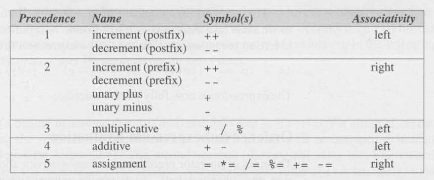

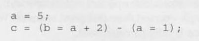

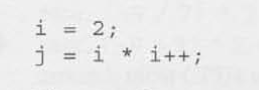
    - It might seem straightforward to assume `j=4`, but in reality, `j` exhibits undefined behavior depending on the compiler and its evaluation strategy. If the expression were interpreted left-to-right, `i++` would first fetch `i=2` and insert that value into the expression at that point. Due to the postfix nature of `i++`, `i` is then incremented to `i=3`. The next (plain) `i` is fetched afterward, now holding the value 3. This simplifies the expression to `j = 3 * 2 = 6`.

## 4.5 Expression Statements

