# Chapter 5 - Selection Statements

- Types of Statements in C:
    - **Selection Statements**: The `if` and `switch` statements allow a program to select a particular execution path from a set of alternatives.
    - **Iteration Statements**: The `while`, `do`, and `for` statements support iteration (looping).
    - **Jump Statements**: The `break`, `continue`, and `goto` statements cause an unconditional jump to some other place in the program. (The return statement belongs in this category, as well.)
    - **Compound Statements**: Groups several statements into a single statement.
    - **Null Statements**: Which performs no actions. 

## 5.1 Logical Expressions

- **Logical Expressions**: Test the value of an expression to see if it is "true" or "false."
    - In C, a comparison such as `i < j` yields an integer: either `0` (false) or `1` (true). 

- **Relation Operators**: Correspond to the `<`, `>`, `≤`, and `≥` operators of mathematics, except that they produce `0` (false) or `1` (true) when used in expressions.
    - Works for comparing `float` and `int` together.
    - Precedence of the relational operators is lower than that of the arithmetic operators.
        - Ex. `i + j < k - 1` means `(i + j) < (k - 1)`
    - The relational operators are left associative.
        - Ex. `i < j < k` means`(i < j) < k`

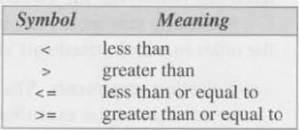

- **Equality Operators**: Test equality between two expressions or values. Left associative and product either `0` (false) or `1` (true). 
    - Have lower precedence than the relational operators.
        - Ex. `i < j == j < k` means `(i < j) == (j < k)` -> Entire statements is True if **both** the left and right are True or False.

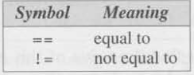

- **Logical Operators**: More complicated logical expressions can be built from simpler ones by using `and`, `or`, and `not`.
    - The `!` operator is **unary**, while `&&` and `||` are **binary**.
    - `!expr` has the value of 1 if the `expr` has the value of 0.
    - `expr1` && `expr2` has the value 1 if the values of `expr1` and `expr2` are both nonzero.
    - `expr1 || expr2` has the value 1 if either `expr1` or `expr2` (or both) has a nonzero value.
    - `!` operator has the same precedence as the unary plus and minus operators.
    - `&&` and `||` precedence is lower than that of the relational and equality operators;
        - Ex. `i < j && k == m` means `(i < j) && (k == m)`
    - The `!` operator is right associative; `&&` and `||` are left associative.

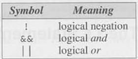

- **Short Circuiting**: Within a logical expression, the first condition evauluated can dicated the behavior of continuing the rest of the evauluation.
    - Ex. `(i != 0) && (j / i > 0)` -> if `i != 0` evaulates to False, meaning `i = 0`, then the right side `(j / i > 0)` is not evaluated.

## 5.2 The `if` Statement

- **`if` Statement**: allows a program to choose between two alternatives by testing the value of an expression.
    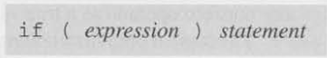    
    - If the value of the expression is nonzero, which C interprets as true, the statement after the parentheses is executed.
        - Ex. 
- Parentheses around the expression are mandatory; they're part of
the `if` statement, not part of the expression.

- Compound Statement: An `if` statement that controls two or more statements.
    - 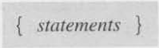
    - 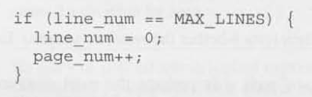

- The `else` Clause: The statement that follows the word `else` is executed if the expression in parentheses has the value 0.
    - 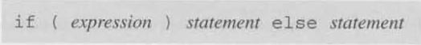
    - 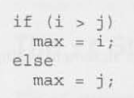
    - 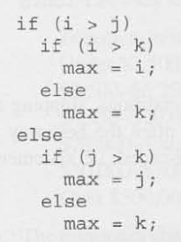
    - 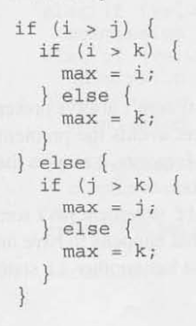

- The "Dangling `else` Problem: When you have nested `if` statements without braces ({}), an `else` is automatically paired with the nearest unmatched `if above it.
    - Ex. 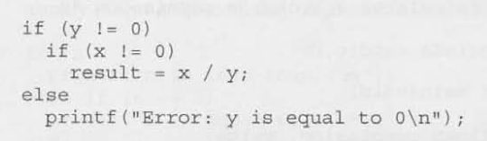 
        - The `else` belongs to the inner `if` statement. But our print string reflects the outer variable conditonal check, so this would be wrong.

- Conditional Expressions: A shorthand way to write an `if-else` statement that returns a value.
    - Conditional Operator: Consists of two symbols (`?` and `:`), which must be used together in the following way: `expr1 ? expr2 : expr3`.
        - Requires three operands instead of one or two, often referred to as a **ternary** operator. 
        - Should be read "if expr1 then expr2 else expr3." 
    - 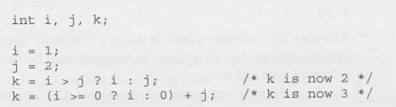

- **Boolean Valyes in C89**: There is no Boolean type defined in C89. 
    - Define a variable as `int` and assign either 0 or 1.
        - Is not very readable and values that "not allowed" can still be assigned on accident. 
        - Define **macros** with names such as `TRUE` and `FALSE`.
            - Ex. `#define TRUE 1` -> `flag = TRUE`-> flag has a value of 1.
    - Define a custom `bool` type masked as a `int`. 
        - Ex. `#define BOOL int` -> `BOOL flag;`-> flag, a variable, now is defined as a `BOOL` which acts a an `int` under the hood.

- **Boolean Values in C99**: C99 provides the `_Bool` type.
    - `_Bool`: An integer type (more precisely, an unsigned integer type), so a _Bool variable is really just an integer variable in disguise.
        - Can only be assigned a value of 0 or 1. 
            - Attempting to store value a nozero value will default to 1.
    - Ex. `_Bool flag; flag = 5`-> The variable `flag` is of type `_Bool` and has a value of 1.
    - Can be tested with an `if` statement.
        - Ex. `if (flag) {...}`-> Tests whether flag is 1
    - `<stdbool.h>`: Header file added with macro definitions for _Bool readability.
        - `bool`: A macro that equal `_Bool`.
        - `true`: A macro which equates to a value of 1.
            - Ex. `flag = true;`
        - `false`: A macro which equates to a value of 0.
            - Ex. `flag = false;`

## 5.3 The `switch` Statement

- `switch` Statement: An alternative to the cascaded `if` statement. 

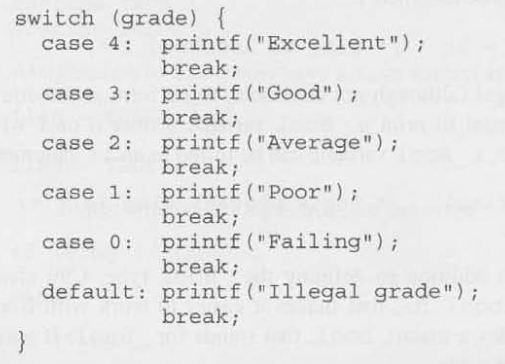

- The variable `grade` is tested against 4, 3, 2, 1, and 0. If it matches a values the statements followed by `:` within the case statement are performed.

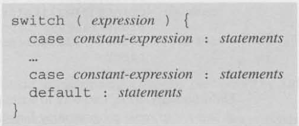

- **Controlling Expression**: The word `switch` must be followed by an integer
expression in parentheses. Characters are treated as integers in C and thus can
be tested in `switch` statements. Floating-point numbers and strings don't
qualify, however.
- **Case Labels**: Each case begins with a label of the form: `case constant-expression :`
    - **Constant Expression**: Much like an ordinary expression except that it can't contain variables or function calls. The constant expression in a case label must evaluate to an integer (characters are also acceptable).
        - Ex. `5` is a constant expression, and `5 + 10` is a constant expression, but `n + 10` isn't a constant expression (unless `n` is a **macro** that represents a constant).
- **Statements**: After each case label comes any number of statements. No braces
are required around the statements. The last statement in each group is normally `break`.

- The Role of the `break` Statement: executing a break statement causes the program to "break" out of the `switch` statement; execution continues at the next statement after the `switch`.
    - The reason that we need break has to do with the fact that the `switch` statement is really a form of "computed jump." When the controlling expression is evaluated, control jumps to the case label matching the value of the switch expression. A case label is nothing more than a marker indicating a position within the switch. When the last statement in the case has been executed, control "falls through to the first statement in the following case; the case label for the next case is ignored. Without break (or some other jump statement), control will flow from one case into the next.
    - Ex. 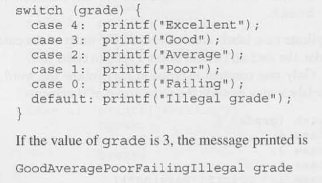