# Chapter 6 - Loops

- **Loop**: A statement whose job is to repeatedly execute some other statement (the loop body).

- **Controlling Expression**: An expression that is evaluated each time the loop body is executed (an **iteration** of the loop); if the expression is true (has a value that's not zero) the loop continues to execute.

- Three iteration statements:
    1. `while`: used for loops whose controlling expression is tested *before* the loop body is executed.
    2. `do`: used if the expression is tested *after* the loop body is executed.
    3. `for`: convenient for loops that increment or decrement a counting variable. 

- `break`: jumps out of a loop and transfers control to the next statement after the loop.
- `continue`: skips the rest of a loop iteration.
- `goto`: jumps to any statement within a function.

## 6.1 The `while` Statement

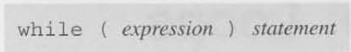

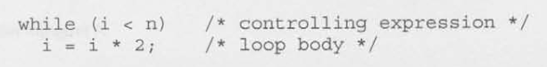

- **Infinite Loops**: A loop that won't terminate because the controlling expression is always a nonzero value.
    - Deliberately can create infinite loops: `while (1) ...`.
        - Unless acted upon by a control statement (`break`, `goto`, `return`).
- Example:
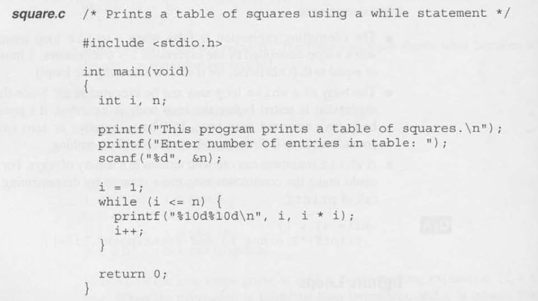

## 6.2 The `do` Statement

- **`do` Statement**: Closely related to the `while` statement but the **controlling expression** is evaluated *after* each execution of the loop body.  

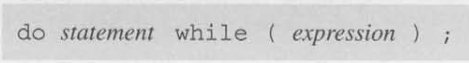

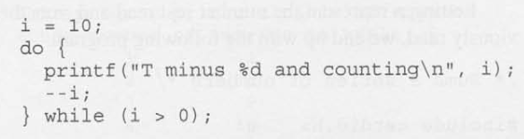

- Example: 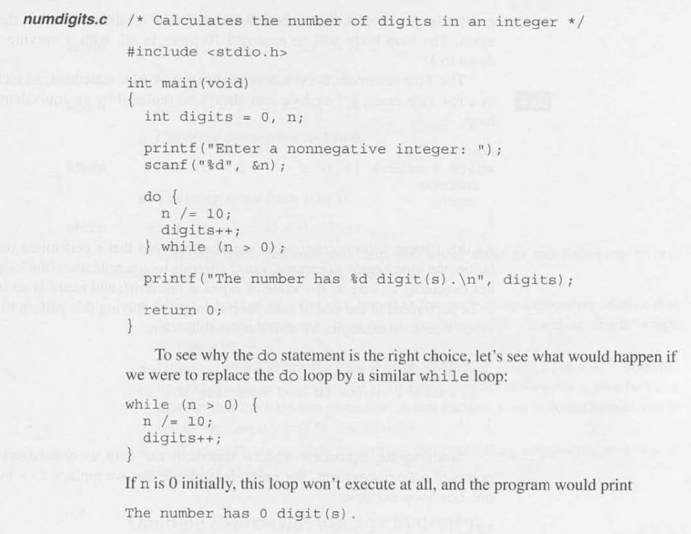

## 6.3 The `for` Statement

- **`for`Statement**: ideal for loops that have a "counting" variable, but it's versatile enough to be used for other kinds of loops as well.

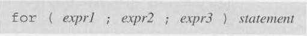

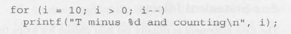

- Hint: `for (init; condition; update)`

- A `for` loop is just *syntactic sugar* for a very specific pattern of a `while` loop.
    - 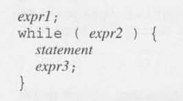
    - expr1 is the initialization of a variable (typically `int` to increment/decrement).
    - expr2 is the controlling expression gating entrance to the loop body.
    - expr3 is the update to the expr1 variable to change the outcome of the evauluation of the controlling expression on the next iteration.

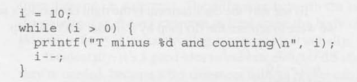

OR

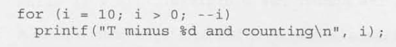

- `for` Statement Idioms:

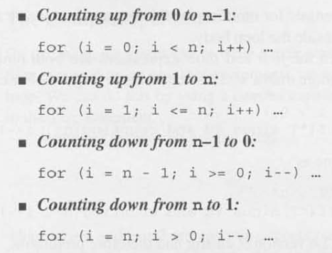

- You can **omit** any expression within the `for` statement, just keep the `;` placeholder for the blank space.
    - Example: 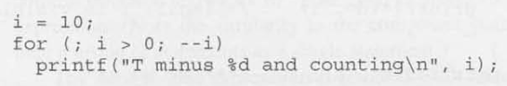
    - Example: 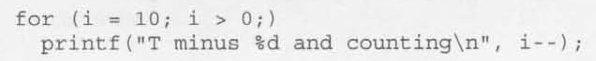

- In **C99 and later**, a variable can be defined in the initialization expression (expr1) of a `for` loop. The scope of that variable is limited to the loop itself.
    - Example: 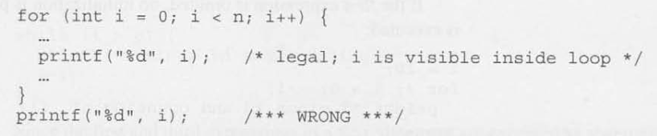

- **Comma Operator**: Used when we might like to write a for statement with two (or more) initialization expressions or one that increments several variables each time through the loop.

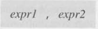

- Example: 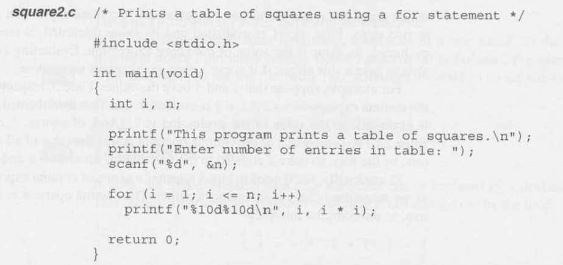

## 6.4 Exiting from a Loop

- `break` Statement: Used to jump out of a `while`, `do`, or `for` loop.
    - transfers control out of the innermost enclosing while, `do`, `for`, or `switch` statement. Thus, when these statements are nested, the break statement can escape only one level of nesting.

- `continue` Statement: Transfers control to a point just before the end of the loop body. Control remains within the loop.
    - "Continues" the loop over again from the beginning.

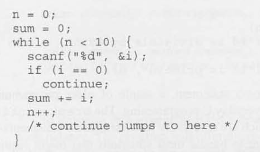

- `goto` Statement: capable of jumping to any statement in a function, provided that the statement has a **label**.
    - NOTE: C99 places an additional restriction on the goto statement, that it can't be used to bypass the declaration of a variable-length array.
    - Label (identifier): An identifier placed at the beginning of a statement.
        - 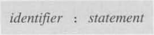

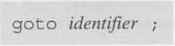

## 6.5 The Null Statement

- `null` Statement: Devoid of symbols except for the semicolon at the end.
    - Example: `i = 0; ; j = 1;`-> the middle statement is `null`.
    - Primarily good for writing loops whose bodies are empty.
        - 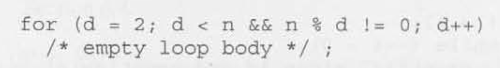

