# Chapter 7 - Basic Types

## 7.1 - 

- Sign Bit: The left most bit in an integer, which determins the *sign* (positive/negative) of the number. 
    - 0 for positive "unsigned" integers
    - 1 for negative "signed" integers.

- Long Integers: Numbers that are too large to be stored in an `int` variable.
- Short Integers: If the number is small enough we can save memory by using `short` variable declaration.

- Combine signed/unsigned with long/short to give greater specification of variable/integer definition.

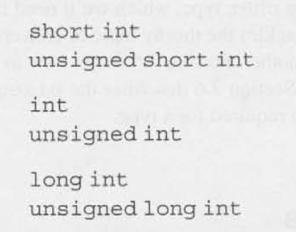

- Different CPU's process different size integers:
    - 16-bit machine:
    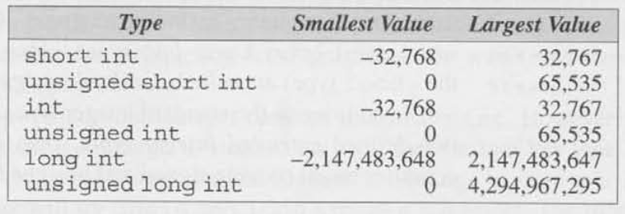
    - 32-bit machine: 
    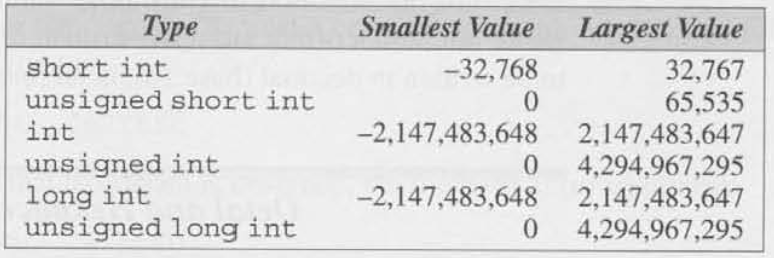
    - 64-bit machine: 
    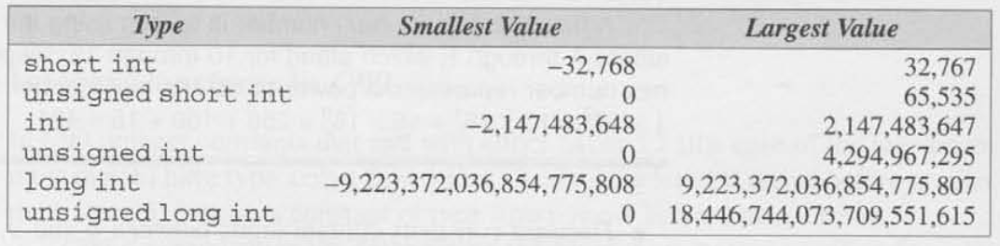

- `<limits.h>` is header file that is a part of the standard library which defines macros that represent the smallest and largest values of each integer type.

- More Types in C99:
    - `long long`: Can be signed or unsigned and is used primarily to support 64-bit machines and their capability of using very large integers.

- Standard Signed Integer Types in C99:    
    - `short int`
    - `int`
    - `long int`
    - `long long int`

- Standard Unsigned Interger Types in C99:
    - `unsigned short int`
    - `unsigned int`
    - `unsigned long int`
    - `unsigned long long int`
    - `unsigned char`
    - `_Bool`

- Extended Integer Types: Allowed in C99 for example.. 128-bit integer types.

- Integer Constants: Numbers that appear in the text of a program, not numbers that are read, written, or computed.
    - C allows integer constants to be written in decimal (base 10), octal (base 8), or hexadecimal (base 16).

- Octal Numbers: Written using only 0 through 7, where each position in an octal number represents a power of 8.
    - Must begin with a `0`!
    - Ex. `077777`

- Hexadecimal: written using the digits 0 through 9 plus the letters A through F (lower can caps), which stand for 10 through 15, respectively. Each position in a hex number represents a power of 16. 
    - Must begin with a `0x`!
        - Ex. `0x7fF`
    - Post-fix `L` or `l` to the end to make the compiler read as a long integer. 
    - Post-fix `U` of `u` to the end to make the compiler read as unsigned (positive).
    - Both `L` and `U` can be used in combination and in any order, if the integer is a long unsigned integer.
    - In C99 `LL` or `ll` have type long long int.

- Integer Overflow: When the result of arithemtic operations becomes too large for the initial variable type.
    - Overflow on signed integers causes *undefined* behavior.
    - Overflow on unsigned integers, the result is defined: we get the correct answer modulo 2**n, where n is the number of bits used to store the result.

- Additional Conversion Specifiers:
    - Unsigned Integer:
        - `u`: decimal (base 10)
        - `o`: octal (base 8)
        - `x`: hexadecimal (base 16)
    - Short Integer:
        - `h` in front of `d`, `o`, `u`, or `x`
    - Long Integer:
        - `l` in front of `d`, `o`, `u`, or `x`
    - Long Long Integer
        - `ll` in front of `d`, `o`, `u`, or `x`

## 7.2 Floating Types

- Three Floating Point Types:
    1. `float`: Single-precision floating-point
        -  suitable when the amount of precision isn't critical (calculating temperatures to one decimal point, for example).
    1. `double`: Double-precision floating-point
        - provides greater precision that `float`, enough for most programs.
    1. `long double`: Extended-precision floating-point
        - Provides the ultimate precision and is rarely used.

- IEEE Floating-Point Standard: Specifications followed by computers regarding floating-point values.
    - Numbers are stored in a form of scientific notation, with each number having three parts: a **sign**, an **exponent**, and a **fraction**.
        - Exponent: The number of bits reserved determines how large or small numbers can be.
        - Fraction: Determines the precision.
    - IEEE Standard 754, developed by the **Institute of Electrical and Electronics Engineers**, provides two primary formats for floating-point numbers: 
        1. single precision (32 bits)
            - Exponent is 8 bits long (1 byte).
            - Fraction is 23 bits long.
            - Sign is 1 bit.
            - Max value = 3.40E10**38 w/ ~6 decimal digits.
        2. double precision (64 bits)
        3. single extended precision (at least 43 bits)
        4. double extended precision (at least 79 bits)
    
    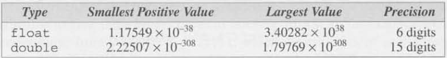

- `<float.h>`: Provides macros on float bit length characteristics.

- C99 Two Floating Type Categories:
    1. Real Floating Types:
        - `float`
        - `double`
        - `long double`
    2. Complex Types:
        - `float_Complex`
        - `double_Complex`
        - `long double_Complex`
        
- Floating Constants: Must contain a decimal point and/or an exponent; the exponent indicates the power of 10 by which the number is to be scaled. If an exponent is present, it must be preceded by the letter E (or e). An optional + or - sign may appear after the E (or e).
    - 57.0 or 57. or 57.0e0 or 57E0 or 5.7e1 or 5.7e+1 or .57e2 or 570.e-1
    - Automatically stored as `double-precision` numbers in memory for easy conversion to `float` if need.
    - Force `float` format append "F" or "f" to the end of the constant.
    - Force `long double` format append "L" or "l" to the end of the constant.
    - In C99, hexadecimals begin with "Ox" or "OX".

- Reading and Writing Floating-Point Numbers
    - `%e`, `%f`, `%g` are used for reading and writing single-precision floating-point numbers (Chapter 3).
    - For READING (`scanf`):
        - `double` prefix with `l`
        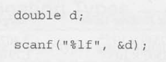
        - `long double` prefix with `L`
        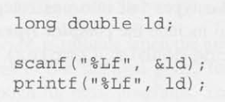
    
## 7.3 Character Types

- `char` Type: The values can vary from one computer to another, because different machines mayhave different underlying character sets.
    - Can be assigned any single character.
    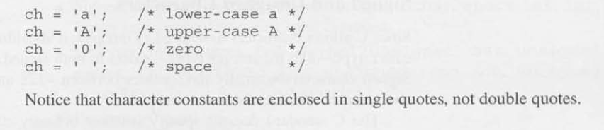

- Character Sets: 
    - ASCII (American Standar Code for Information Interchange), a 7-bit code capable of representing 128 characters.
        - Character codes range from 0000000 - 1111111. We can think of these as integers ranging from 0 to 127.
        - The digits 0 to 9 are represented by the codes 0110000-0111001, and the uppercase letters A to Z are represented by 1000001-1011010.
        - **Latin-1** is an extension to 256-characters necessary for Western European and many African languages.
        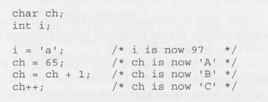
        - `char` is actually just `int` so we can compare using logical operators like `<`, `>`, `<=`, `>=`.
        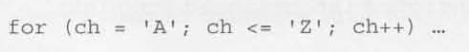

- **Signed and Unsigned Characters**: Since C allows characters to be used as integers, it shouldn't be surprising that the char type-like the integer types exists in both signed and unsigned versions.   
    - Signed characters normally have values between -128 and 127.
    - Unsigned characters have values between 0 and 255.

- C89 uses the term **intergral types** to refer to both the integer types and the character types. Enumerated types are also integral types.
- C99 does use the term **integral types**, instead it expands the meaning of "integer types" to include the character types and the enumerated types. C99's `_Bool` type is considered to be an unsigned integer type.

- Arithmetic Types: The integer types and floating types are collectively known as arithmetic types.
    - Summary of the arithmetic types in C89, divided into categories and sub-categories:
        1. Integral Types
            - `char`
            - Signed integer types
            - Unsigned intger types
            - Enumerated types
        2. Floating types
    - C99
        1. Integral Types
            - `char`
            - Signed integer types
            - Unsigned intger types
            - Enumerated types
        2. Floating types
            - Real floating types
            - Complex types

- Escape Sequences: A special notation so that programs can deal with every character in the underlying character set.
    1. Character Escapes
    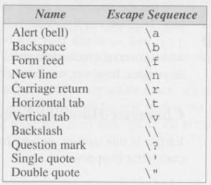

    2. Numeric Escapes:
        - Octal Escape Sequence: Consists of the \ character followed by an octal number with at most three digits. (This number must be representable as an unsigned character, so its maximum value is normally 377 octal.) For example, the escape character could be written \ 3 3 or \033. Octal numbers in escape  equences-unlike octal constants— don't have to begin with 0.
        - Hexadecimal Escape Sequence: Consists of \x followed by a hexadecimal number. Although C places no limit on the number of digits in the hexadecimal number, it must be representable as an unsigned character (hence it can't exceed FF if characters are eight bits long). Using this notation, the escape character would be written \x1b or \x1B. The x must be in lower case, but the hex digits (such as b) can be upper or lower case.

- `tooupper()`: A function in C's `<ctype.h>` header file that converts a charater value to its corresponding uppercase character value.

- Reading and Writing Characters: `%c` conversion specification allows `scanf`and `printf` to read and write single characters.
    - `scanf` does not skip whitespace before reading a character, put a space into the format string to force skip of whitespace.
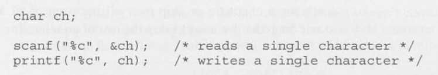

- `ch = getchar()`:  Reads one character from the terminal and returns.
    - Returns and `int` value.
    - Does not skip whitespace.
- `putchar(ch)`: Writes a single character to the termial.

## 7.4 Type Conversion

- Implicit Conversion: Conversions that the compiler does for you during arithmetic that can be safely assumed, like adding a 16-bit short and a 32-bit int, the compiler will convert the short to 32-bit, int + float = float, etc. 
    - When the operands in an arithmetic or logical expression don't have the same type. (C performs what are known as the usual arithmetic conversions.)
    - When the type of the expression on the right side of an assignment doesn't match the type of the variable on the left side.
    - When the type of an argument in a function call doesn't match the type of the corresponding parameter.
    - When the type of the expression in a `return` statement doesn't match the function's return type.
    - In C99: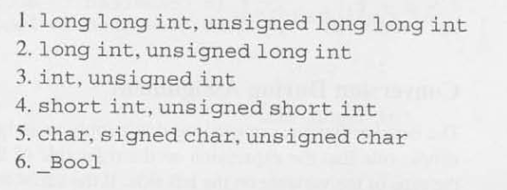

- Usual Arithmetic Conversions: Convert operands to the "narrowest" type that will safely accommodate both values. (Roughly speaking, one type is narrower than another if it requires fewer bytes to store.)
    - Promotion: converting the operand of the narrower type to the type of the other operand.
    - C89:
        1. The type of either operand is a floating type.
        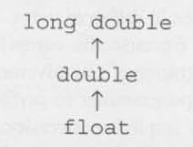
        2. Neither operand type is a floating type.
        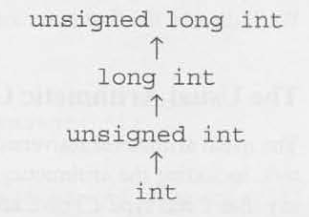
    - C99: 
        1. The type of either operand is a floating type. As long as neither operand has a complex type, the rules are the same as before. 
        2. Neither operand type is a floating type. First perform integer promotion on both operands. If the types of the two operands are now the same, the process ends. Otherwise, use the following rules, stopping at the first one that applies: 
            - If both operands have signed types or both have unsigned types, convert the cast expression operand whose type has lesser integer conversion rank to the type of the operand with greater rank.
            - If the unsigned operand has rank greater or equal to the rank of the type of the signed operand, convert the signed operand to the type of the unsigned operand.
            - If the type of the signed operand can represent all of the values of the type of the unsigned operand, convert the unsigned operand to the type of the signed operand.
            - Otherwise, convert both operands to the unsigned type corresponding to the type of the signed operand.

- Explicit Conversion: Programmed conversions using the cast operator. 

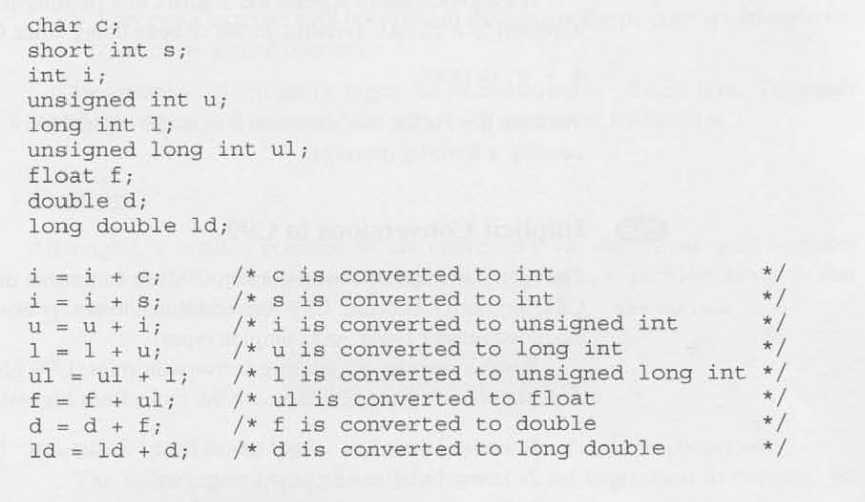

- Conversion During Assignment: C follows the simple rule that the expression on the right side of the assignment is converted to the type of the variable on the left side. If the variable's type is at least as "wide" as the expression's,

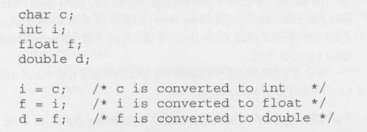

- Casting: 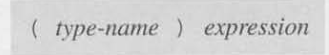
    - `type-name` specifies the type to which the expression should be converted.
    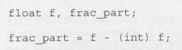

# 7.5 Type Definitions

- Type Definition: Defining custom named types.
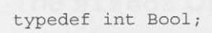

- Special `_t` Types: The C library itself uses typedef to create names for types that can vary from one C implementation to another; these types often have names that end with `t`, such as `ptrdiff_t`, `size_t`, and `wchar_t`. 
    - C99 `<stdint.h>` uses typedef to define names for integer types with a particular number of bits. For example, `int32_t` is a signed integer type with exactly 32 bits. 

# 7.6 The `sizeof` Operator

- `sizeof`: Operator allows a program to determine how much memory is required to store values of a particular type. 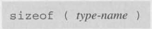
    - The value of the expression `sizeof ( type-name )`is an unsigned integer representing the number of bytes required to store a value belonging to type-name. 
    - `sizeof (char)` is always 1, but the sizes of the other types may vary. 
    - On a 32-bit machine, `sizeof ( int )` is normally 4. 
    - Note that `sizeof` is a rather unusual operator, since the compiler itself can usually determine the value of a `sizeof` expression.
    - In C89 cast the `sizeof` result to `unsigned long` before printing with the `%lu` coversion specifier.
    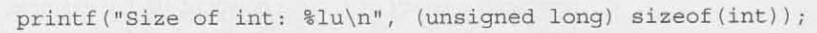
    - In C99 no cast is needed, just print with the `z` prefix to the typical `%u` integer code(s).
    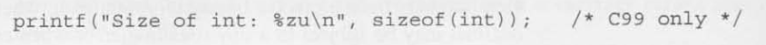