# Chapter 9 - Functions

## 9.1 Defining and Calling Functions

- 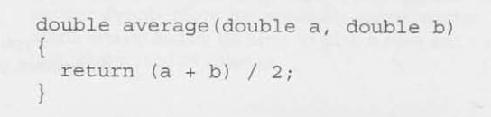
    - The word `double` at the beginning is the functions return type.
    - The identifiers `a` and `b` (the function's parameters) represent the two numbers that will be supplied when `average` is called.
        - Each parameter must have a type.
    -  Every function has an executable part, called the body, which is enclosed in bracs.
    - A body may contain a return statement, executing this statement causes the function to "return" to the place from which it was called.

- 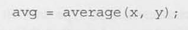
    - If needed we can save the value returned from functions within a variable.

- `void` return type: A function who does not return anything.
    - 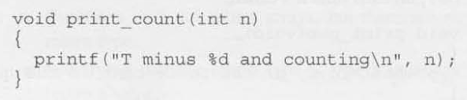
    

- `void` parameters: A function that has no parameters can be defined using `void`.
    - 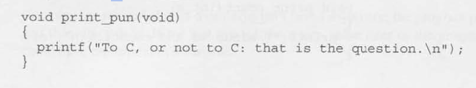

- Function Definitions: 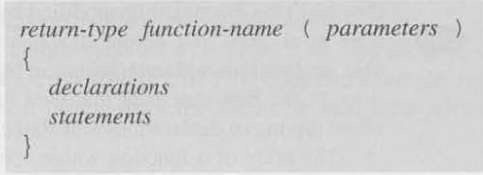
    - Rules governing return types of functions:    
        1. Functions may not return arrays, but there are no other restrictions on the return type.
        2. Specifying that the return type is `void`indicates that the function doesn't return a value.
        3. If the return type is omitted in C89, the function is presumed to return a value of type `int`. In C99, it's illegal to omit the return type of a function.
    - Function return types can be given on the line above a function declaration.
    - All parameters must have a return type despite if the same type(s) were used prior.
    - If a function returns a value that we intentionally want to ignore, we can either avoid assigning it to a variable or explicitly cast the function call to `(void)` to indicate that the return value is being discarded on purpose.
        - Ex. `printf` returns the number of characters printed, often this is ignored and not saved in a variable. We could do the following:
            - 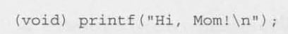

## 9.2 Function Declarations

- Implicit Declaration: When an older (C89) compiler assumes that a function returns an `int` or the order/types of the the parameters due to the functions not being defined prior to being read/used. Modern (C99) compilers will throw a compilation error. 

- Function Declaration: Provides the compiler with a brief glimpse at a function whose full definition will appear later. A function declaration esembles the first line of a function definition with a semicolon added at the end:
    - 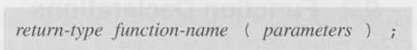
    - Aka "Function prototypes": A prototype provides a complete description of how to call a function: 
        - How many arguments to supply.
        - What their types should be
        - What type of result will be returned.
    - Function prototypes don't have to specify the *names* of the function's parameters, as long as their *types* are present.
        - 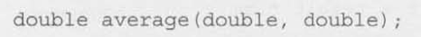

## 9.3 Arguments

- Arguements vs Parameters:
    - Parameters appear in function definitions; they're dummy names that represent values to be supplied when the function is called. 
    - Arguments are expressions that appear in function calls.
        - In C, arguments are **passed by value**: when a function is called, each argument is evaluated and its value assigned to the corresponding parameter.
        - Since the parameter contains a **copy** of the argument's value, **any changes made to the parameter during the execution of the function don't affect the argument**. 

- Arguement Conversions: C allows function calls in which the types of the arguments don't match the types of the parameters. 
    - **The compiler has encountered a prototype prior to the call**: The value of each argument is implicitly converted to the type of the corresponding parameter as if by assignment. 
    - **The compiler has not encountered a prototype prior to the call**: The compiler performs the default argument promotions:
        1. `float` arguments are converted to `double`.
        2. The integral promotions are performed, causing `char` and `short` arguments to be converted to `int`. (In C99, the integer promotions are performed.)

- Array Arguements: Arrays can be passed as arguments to functions, but their length information is not preserved.
    - When an array is passed to a function, it decays to a pointer to its first element.
    - Inside the function, the parameter is treated as a pointer, not an array.
    - Calling `sizeof` on an array parameter therefore yields the size of the pointer (typically 8 bytes on a 64-bit system), not the size of the original array.
    - 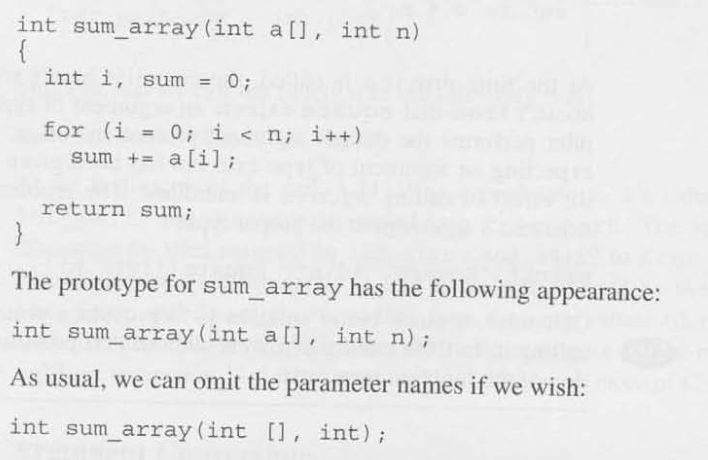

- Variable-Length Array Parameters: Using variables to dynamically set the length or arrays used as function parameters.
    - 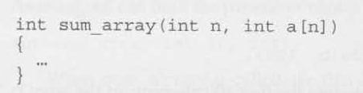
    - Note that `n` is initialized before being used as a feature of the array parameter declaration.

- Prototypes and Array Parameters: 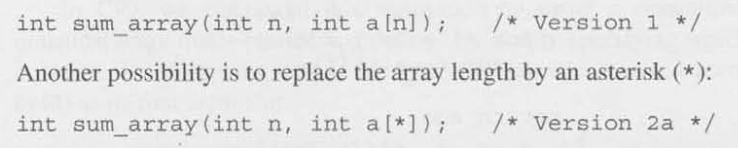
    - The reason for using the `*` notation is that parameter names are optional in function declarations. If the name of the first parameter is omitted, it wouldn't be possible to specify that the length of the array is `n`, but the `*` provides a clue that the length of the array is related to parameters that come earlier in the list:
        - 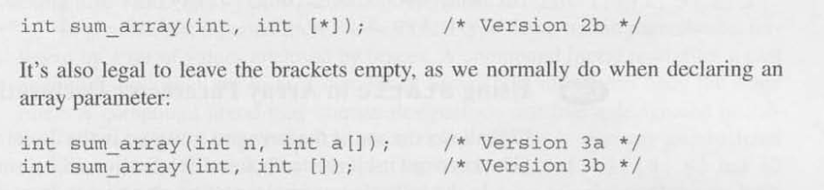
    - Example: 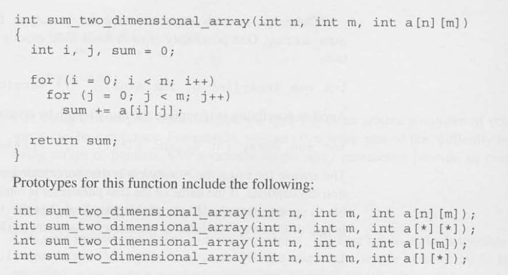

- Using `static` in Array Parameter Declarations: 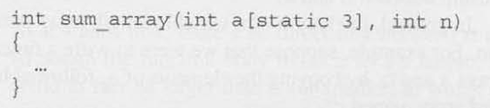  
    - Putting `static` in front of the number 3 indicates that the length of a is guaranteed to be at least 3.
    - Using `static` in this way has no effect on the behavior of the program. The preSence of `static` is merely a "hint" that may allow a C compiler to generate faster instructions for accessing the array. 
        - If the compiler knows that an array will always have a certain minimum length, it can arrange to "prefetch" these elements from memory when the function is called, before the elements are actually needed by statements within the function.
    - Multidimensional Arrays: `static` can only be applied to the first dimension of the MD array. 

- Compound Literals: An unnamed array that's created "on the fly" by simply specifying which elements it contains.
    - 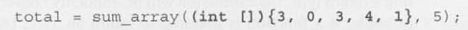
    - You can also specify the length by: 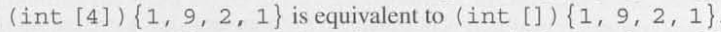
    - `lvalues`, so that values of its elements can be changes.
    - Can make it **read-only** by adding `const`: 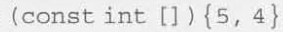

## 9.4 The `return` Statement

- `return`: A statement that stops a function and returns back to where the function was called, with any value following the return keyword.
    - If the type of the expression in a `return` statement doesn't match the function's return type, the expression will be implicitly converted to the return type.
    - `return` statements may appear in functions whose return type is `void`, provided that no expression is given.
    - When used in `main` the `return` statement exits the program.
     
## 9.5 Program Termination

- Omitting `return` type: 
    - Older C programs often omit the main function return type.
    - C99, omitting the return type of a function is illegal. 

- `exit` Function: A function within the `<stdlib.h>`, with arguements passed to `exit`that have the same meaning as `main`'s return value. Both indicate the programs status at termination.
    - `exit(0)`: Normal termination
    - `exit(>0)`: Abnormal termination
    - `EXIT_SUCCESS` and `EXIT_FAILURE` are macros defined within the `<stdlib.h>` that are implementation-defined, with typical values of 0 and 1, respectively.
    - The difference between `return` and `exit` is that `exit` causes program termination regardless of which function calls it. The `return` statement causes program termination only when it appears in the `main` function.

## 9.6 Recursion

- Recursive function: A function is recursive if it calls itself.

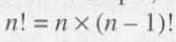
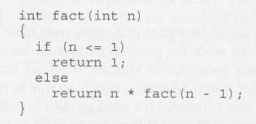
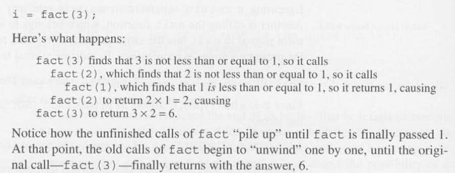
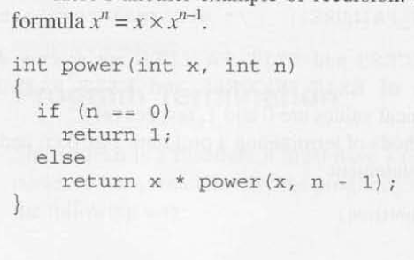
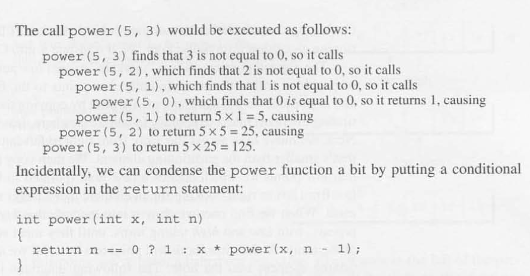

- Termination Condition: A test that is evaluated as soon as a recursive function is called to either terminate the recursive calls or continue to recurse.
    - All recursive functions need some kind of termination condition in order to prevent infinite recursion. 

- Quicksort Algorithm: A sorting algorithm that is an example of the **divide-and-conquer** technique.
    - Divide-and-conquer: Large problems are divided into smaller pieces that are tackled by the same algorithm.
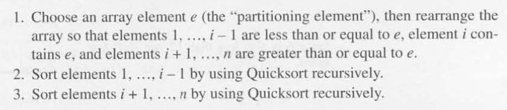 note: array example is indexed starting from 1 to n.
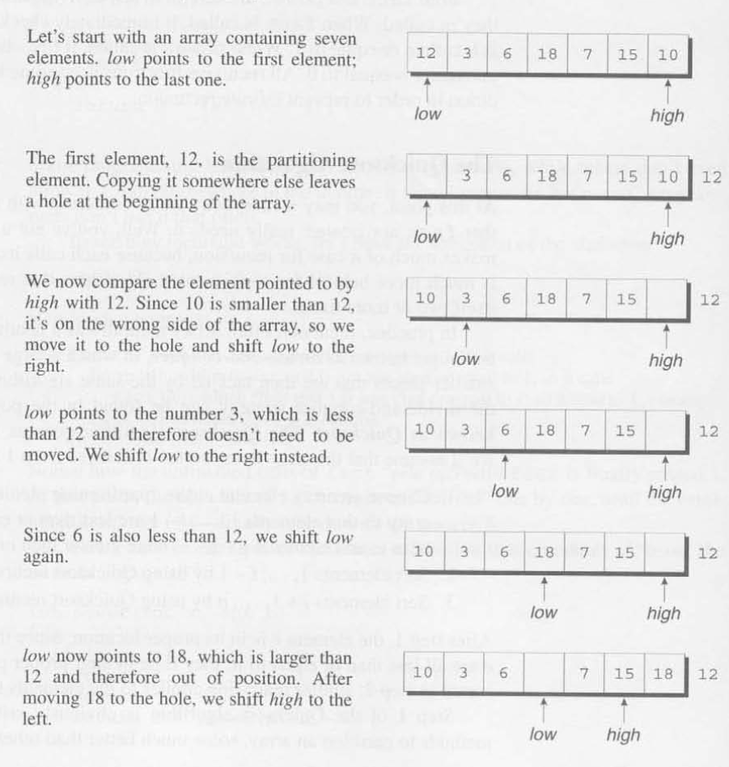
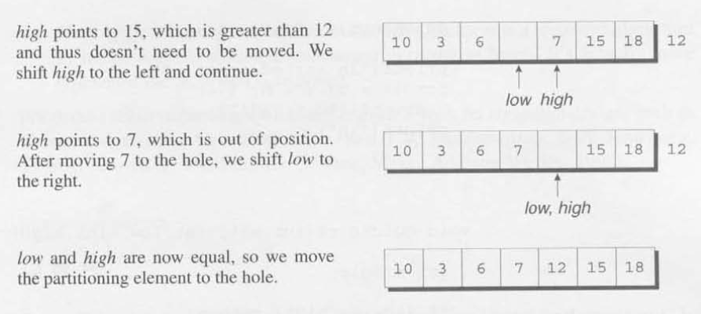

- Improving Quicksort: 
    1. Improving the partitioning algorithm. 
    2. Using a different method to sort small arrays (<=25 elements).
    3. Making Quicksort nonrecursive.